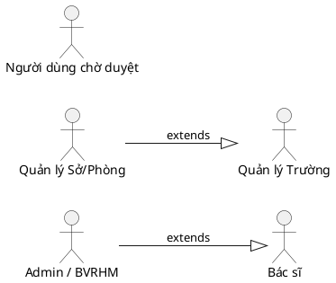
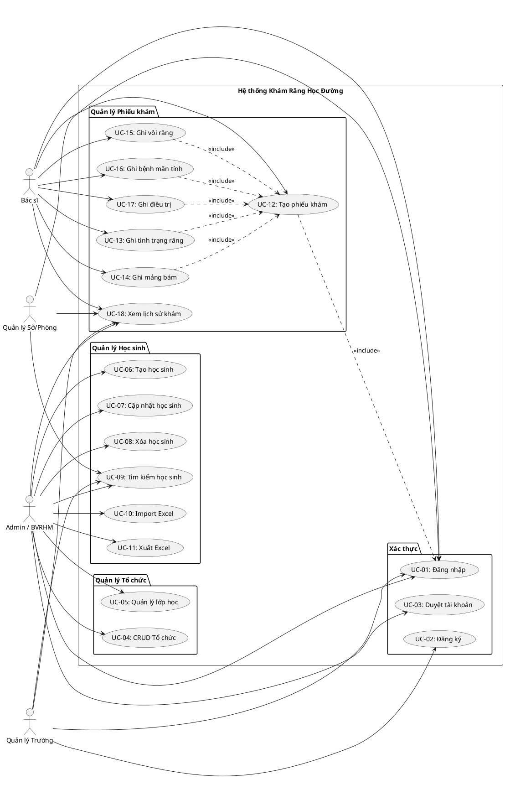
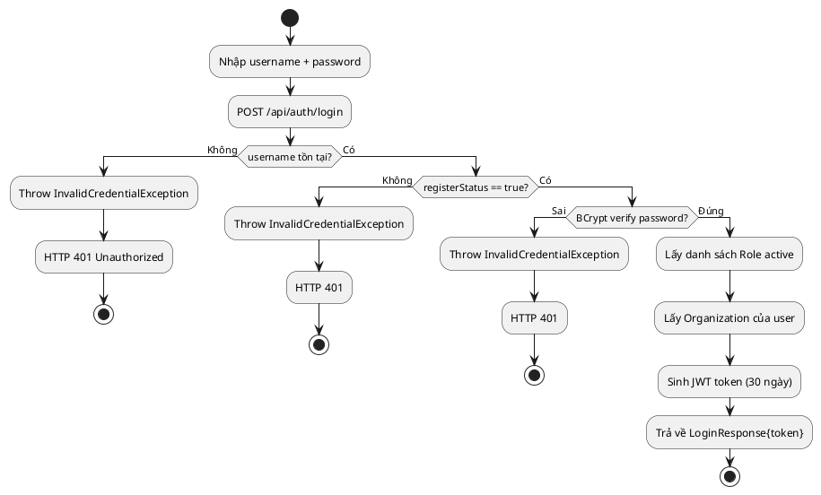
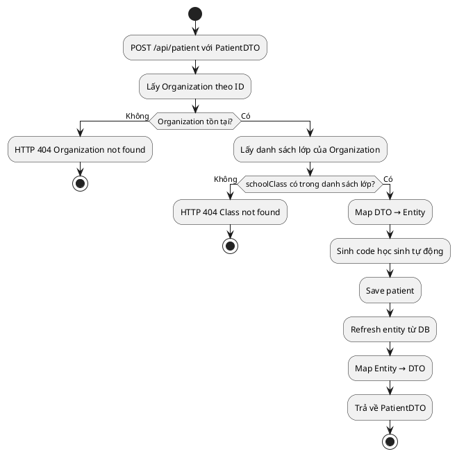
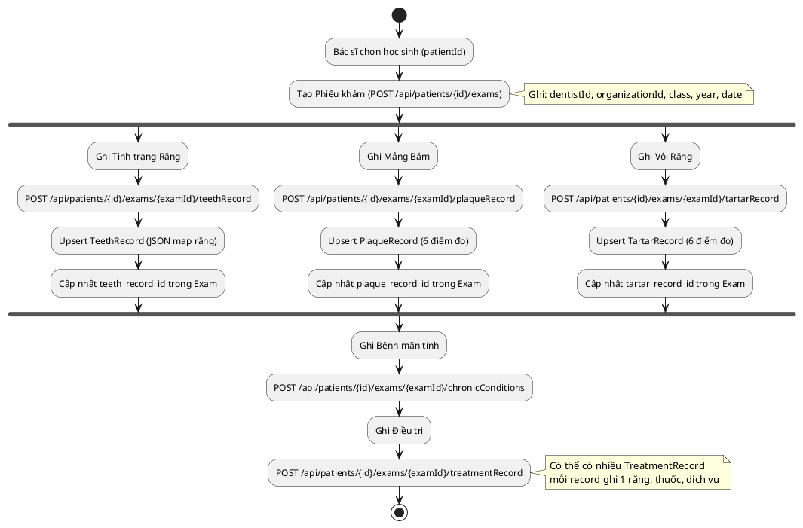
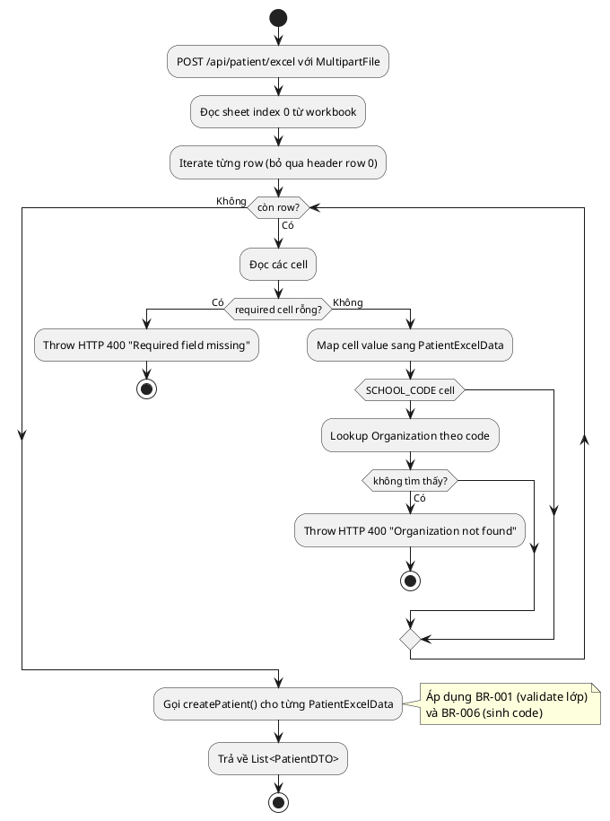
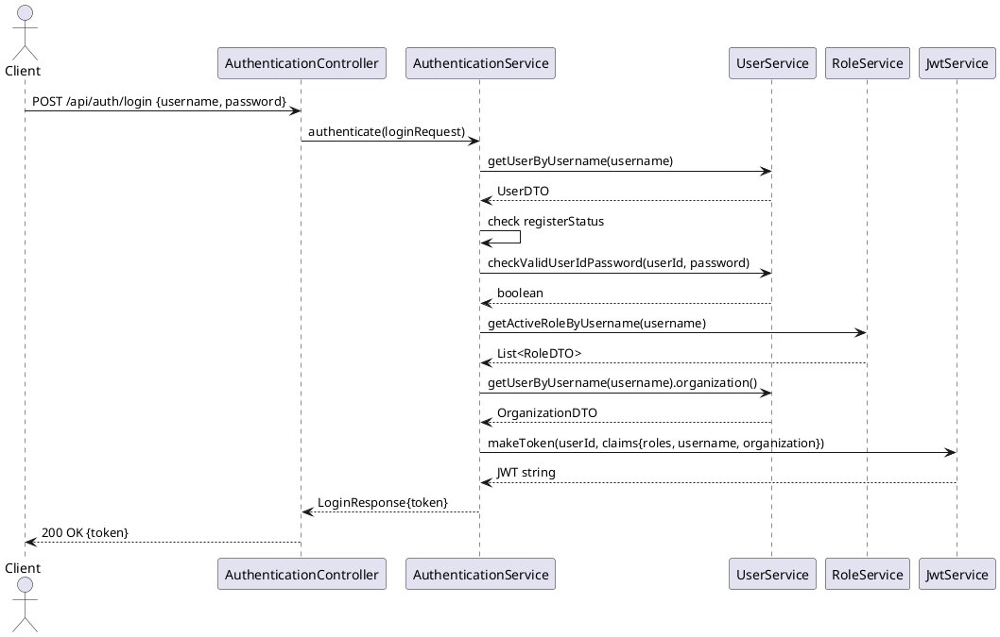
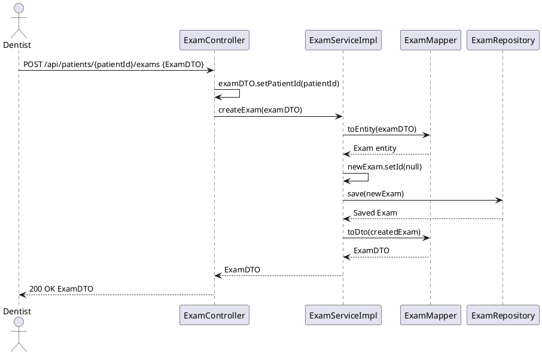
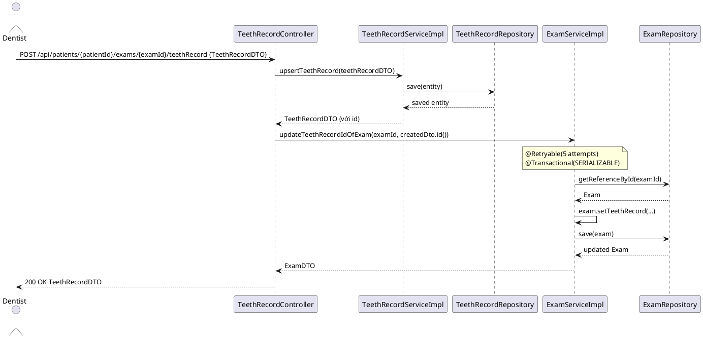
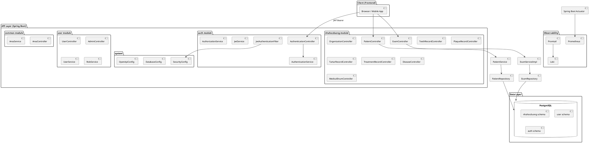

# TÀI LIỆU ĐẶC TẢ YÊU CẦU HỆ THỐNG (SRS)
# Hệ thống Khám Răng Học Đường — Backend API

**Phiên bản:** 1.0 (Reverse Engineering)
**Ngày tạo:** 2024
**Nguồn:** Phân tích từ source code `nhahocduongbe-master`
**Tổ chức:** Bệnh viện Răng Hàm Mặt Trung ương TP. HCM (BVRHM)

---

## Mục lục

1. [Giới thiệu (Introduction)](#1-giới-thiệu)
2. [Tổng quan hệ thống (Overall Description)](#2-tổng-quan-hệ-thống)
3. [Các Actor và Phân quyền](#3-các-actor-và-phân-quyền)
4. [Functional Requirements](#4-functional-requirements)
5. [Non-Functional Requirements](#5-non-functional-requirements)
6. [Business Rules](#6-business-rules)
7. [Use Case Analysis](#7-use-case-analysis)
8. [Activity Diagrams](#8-activity-diagrams)
9. [Sequence Diagrams](#9-sequence-diagrams)
10. [Database Design](#10-database-design)
11. [Architecture Design](#11-architecture-design)
12. [API Specification](#12-api-specification)
13. [Security Design](#13-security-design)
14. [Technical Debt Analysis](#14-technical-debt-analysis)
15. [Bug Risk Analysis](#15-bug-risk-analysis)
16. [Future Improvement Recommendations](#16-future-improvement-recommendations)

---

## 1. Giới thiệu

### 1.1 Mục đích

Tài liệu này được tạo ra thông qua quá trình **Reverse Engineering** toàn bộ source code của hệ thống backend "Khám Răng Học Đường" (nhahocduongbe). Mọi kết luận đều dựa trực tiếp vào code thực tế.

Mục tiêu: tái tạo lại bộ tài liệu phân tích thiết kế phục vụ bảo trì, sửa lỗi, nâng cấp, và onboarding developer mới.

### 1.2 Phạm vi

Hệ thống là một **RESTful API Backend** viết bằng Java Spring Boot, phục vụ chương trình khám răng học đường tại các trường học thuộc các tỉnh (hiện có dữ liệu thực của tỉnh **Vĩnh Long** và **Bến Tre**). Đơn vị chủ quản: **Bệnh viện Răng Hàm Mặt Trung ương TP. Hồ Chí Minh (BVRHM)**.

### 1.3 Định nghĩa, từ viết tắt

| Thuật ngữ | Giải thích |
|-----------|-----------|
| BVRHM | Bệnh viện Răng Hàm Mặt |
| SYT | Sở Y tế |
| PGD | Phòng Giáo dục và Đào tạo |
| TH | Trường Tiểu học |
| JWT | JSON Web Token |
| RBAC | Role-Based Access Control |
| JPQL | Java Persistence Query Language |
| PI | Plaque Index — Chỉ số mảng bám |
| RVV | Răng Vĩnh Viễn |
| RS | Răng Sữa |

### 1.4 Công nghệ sử dụng

Dựa trên `pom.xml` và `application.yaml`:

| Công nghệ | Phiên bản | Ghi chú |
|-----------|-----------|---------|
| Java Spring Boot | 3.1.0 | Framework chính |
| Spring Data JPA | — | ORM layer |
| Spring Security | — | Authentication/Authorization |
| Spring Data REST | — | Expose repository qua REST |
| PostgreSQL | — | Database |
| Hibernate | — | JPA implementation, dialect PostgreSQL |
| JJWT | — | JWT token |
| MapStruct | — | Entity ↔ DTO mapping |
| Lombok | — | Boilerplate code generation |
| Apache POI | — | Excel import/export |
| SpringDoc OpenAPI | 2.5.0 | Swagger UI |
| Spring Modulith | 0.6.0 | Modular architecture support |
| Prometheus/Loki/Promtail | — | Monitoring stack (Docker Compose) |
| Docker | — | Container deployment |

---

## 2. Tổng quan hệ thống

### 2.1 Mục đích nghiệp vụ

Hệ thống hỗ trợ **chương trình khám răng học đường** — một chương trình y tế cộng đồng trong đó bác sĩ nha khoa từ bệnh viện đến các trường học để khám và ghi nhận tình trạng răng miệng của học sinh. Hệ thống quản lý toàn bộ vòng đời dữ liệu:

```
Đăng ký trường học → Đăng ký học sinh → Tổ chức buổi khám → Ghi nhận kết quả khám → Báo cáo thống kê
```

### 2.2 Đối tượng sử dụng (Stakeholders)

Từ phân tích `OrganizationType.java` và `SecurityConfig.java`:

| Actor | Mô tả | Tổ chức tương ứng |
|-------|-------|-------------------|
| Admin hệ thống | Quản trị toàn hệ thống, duyệt tài khoản | BVRHM (type=4) |
| Quản lý BVRHM | Quản lý toàn bộ dữ liệu | BVRHM |
| Bác sĩ (Dentist) | Thực hiện khám, ghi nhận kết quả | BVRHM |
| Quản lý Sở/Phòng (DEPARTMENT) | Xem dữ liệu theo khu vực (areaCode) | SYT / PGD (type=2,3) |
| Quản lý Trường (SCHOOL) | Xem/quản lý dữ liệu học sinh của trường | Trường học (type=1) |

> **Bằng chứng:** `OrganizationType.java` định nghĩa 4 loại: `SCHOOL(1)`, `DEPARTMENT(2)`, `MINISTRY(3)`, `HCMC_CENTRAL_DENTAL_HOSPITAL(4)`. `AuthorizationService.java` phân biệt quyền `SCHOOL` (lọc theo `organizationId`) vs `DEPARTMENT` (lọc theo `areaCode`).

### 2.3 Các module chính

```
nhahocduongbe
├── auth        — Xác thực (Login, JWT)
├── user        — Quản lý người dùng, Role
├── common      — Dữ liệu vùng/địa chỉ hành chính (Area)
└── nhahocduong — Nghiệp vụ chính:
    ├── Organization — Quản lý trường/đơn vị
    ├── Patient      — Quản lý học sinh
    ├── Exam         — Quản lý phiếu khám
    ├── TeethRecord  — Tình trạng răng
    ├── PlaqueRecord — Mảng bám (Plaque Index)
    ├── TartarRecord — Vôi răng (Tartar)
    ├── TreatmentRecord — Điều trị
    ├── Disease      — Bệnh mãn tính
    └── Medication   — Thuốc/vật tư
```

---

## 3. Các Actor và Phân quyền

### 3.1 Actor Hierarchy



### 3.2 Phân quyền theo Role

Dựa trên `AuthorizationService.java` và dữ liệu seed trong `4-user.sql`:

| Role Code | Role Name | Quyền |
|-----------|-----------|-------|
| QL | Quản lý | Xem dữ liệu được giới hạn theo tổ chức |
| (Admin) | Admin | Duyệt tài khoản, quản lý toàn hệ thống |

> **Lưu ý:** Hệ thống hiện có model RBAC đầy đủ (Policy, Resource, Rule, Role) nhưng **chưa được implement vào logic phân quyền API**. `SecurityConfig.java` dòng `anyRequest().permitAll()` cho thấy toàn bộ API đang **mở** sau khi JWT hợp lệ.

### 3.3 Logic phân quyền dữ liệu (Data-level Authorization)

Từ `AuthorizationService.java`:

```java
switch (user.getOrganization().getType()) {
    case SCHOOL -> data.setOrganizationId(user.getOrganization().getId());
    case DEPARTMENT -> data.setAreaCode(user.getOrganization().getAreaCode());
}
```

| Loại tổ chức | Phạm vi dữ liệu |
|-------------|----------------|
| SCHOOL (type=1) | Chỉ thấy dữ liệu của trường mình (filter theo `organizationId`) |
| DEPARTMENT (type=2,3) | Thấy dữ liệu của tất cả trường trong khu vực (`areaCode`) |
| BVRHM / Admin (type=4, null) | Thấy toàn bộ dữ liệu |

---

## 4. Functional Requirements

### 4.1 Quản lý Tổ chức (Organization)

**Controller:** `OrganizationController.java`
**Service:** `OrganizationServiceImpl.java`

| Chức năng | Mô tả | Business Rule |
|-----------|-------|---------------|
| Tạo tổ chức | Tạo mới trường/phòng/sở | Không được có lớp trùng tên (duplicate class check); Tự động sinh `code` theo `areaCode` |
| Sửa tổ chức | Cập nhật thông tin | Không được có lớp trùng tên |
| Xóa (soft delete) tổ chức | Đặt `status=false` | **Không thể xóa nếu còn học sinh thuộc tổ chức** |
| Xem chi tiết | Lấy thông tin 1 tổ chức | — |
| Tìm kiếm/phân trang | Tìm theo tên, areaCode, loại | Kết quả bị giới hạn theo quyền người dùng |
| Lấy danh sách tất cả | Sắp xếp theo tên | — |
| Kiểm tra lớp có thể xóa | Xác định lớp nào đang có học sinh | Không thể xóa lớp còn học sinh |

**Thuộc tính tổ chức:**
- `name`, `code` (tự sinh), `address`, `areaCode`
- `type`: SCHOOL / DEPARTMENT / MINISTRY / BVRHM
- `classes`: JSON Map<Grade, List<String>> (ví dụ: `{"1": ["1A", "1B"], "2": ["2A"]}`)
- `headMember`: User là hiệu trưởng/trưởng đơn vị
- `parent`: Tổ chức cha (phân cấp)
- `status`: true/false (soft delete)

**Sinh code tổ chức** (`OrganizationHelper.generateCode`):
- Format: `{areaCode_3_digits}{order_3_digits}` (ví dụ: `086001`)
- Lấy code cao nhất hiện tại + 1

### 4.2 Quản lý Học sinh (Patient)

**Controller:** `PatientController.java`
**Service:** `PatientServiceImpl.java`

| Chức năng | Input | Output | Business Rule |
|-----------|-------|--------|---------------|
| Tạo học sinh | PatientDTO | PatientDTO | Lớp học phải tồn tại trong danh sách lớp của trường |
| Sửa học sinh | PatientDTO, id | PatientDTO | — |
| Xóa (soft delete) | id | boolean | **Không thể xóa học sinh đã có phiếu khám** |
| Xem chi tiết | id | PatientDTO | — |
| Tìm kiếm/phân trang | PatientSearchCriteria | Page<PatientDTO> | Lọc theo tên, số BHYT, tên trường, lớp, areaCode |
| Lấy tất cả (có phân trang) | Pageable | Page<PatientDTO> | — |
| Import từ Excel | MultipartFile (.xlsx) | List<PatientDTO> | Validate required fields; Validate organization code |
| Xuất ra Excel | — | .xlsx file | Xuất toàn bộ học sinh đang active |
| Tải template Excel | — | .xlsx file | Template có sheet danh sách trường động |

**Sinh code học sinh** (`PatientHelper.generateCode`):
- Format: `{org_code_6_chars}{order_3_digits}` (ví dụ: `086001001`)

**Thuộc tính học sinh:**
- `fullName`, `code`, `healthInsuranceNumber`, `gender` (1=nam, 2=nữ)
- `birthDate`, `ethnic` (enum), `areaType` (Thành thị/Ngoại ô/Nông thôn)
- `addressLine`, `phoneNumber`, `nationalIdNum`, `careTaker`
- `organization` (FK), `schoolClass`, `chronicConditions` (M-N với Disease)
- `status`: true/false

### 4.3 Quản lý Phiếu khám (Exam)

**Controller:** `ExamController.java`
**Service:** `ExamServiceImpl.java`

| Chức năng | Input | Output | Ghi chú |
|-----------|-------|--------|---------|
| Tạo phiếu khám | ExamDTO (patientId từ path) | ExamDTO | Gán `patientId` từ path variable |
| Sửa phiếu khám | ExamDTO | ExamDTO | Partial update qua MapStruct |
| Xóa (soft delete) | id | boolean | Đặt `status=false` |
| Lấy danh sách phiếu khám của học sinh | patientId, status | List<ExamDTO> | Sắp xếp DESC theo id |
| Lấy chi tiết phiếu khám | patientId, examId, status | ExamDTO | — |
| Tìm kiếm phiếu khám | ExamSearchCriteria, patientId | Page<ExamDTO> | Lọc theo ngày, patientId, examId |
| Cập nhật teeth_record_id | examId, teethRecordId | ExamDTO | SERIALIZABLE + Retry (5 lần, delay 300ms) |
| Cập nhật plaque_record_id | examId, plaqueRecordId | ExamDTO | SERIALIZABLE + Retry |
| Cập nhật tartar_record_id | examId, tartarRecordId | ExamDTO | SERIALIZABLE + Retry |

**Thuộc tính phiếu khám:**
- `patient`, `dentist`, `organization`
- `schoolClass`, `year`, `profileNumber` (unique)
- `date`
- `teethRecord` (1-1), `plaqueRecord` (1-1), `tartarRecord` (1-1)
- `chronicConditions` (M-N với Disease)
- `treatmentRecords` (1-N)
- `status`: true/false

### 4.4 Quản lý Tình trạng Răng (TeethRecord)

**Controller:** `TeethRecordController.java`
**Service:** `TeethRecordServiceImpl.java`

Ghi nhận tình trạng từng răng theo mã FDI (11-18, 21-28, 31-38, 41-48, 51-55, 61-65, 71-75, 81-85).

Mỗi răng lưu dưới dạng `ToothCondition`:
- `problem`: enum `ToothProblem` (0=Bình thường, 1=Sâu, 2=Sâu trám lại, 3=Trám tốt, 4=Mất do sâu, 5=Mất lý do khác, 6=Bít hố rãnh, 7=Trụ cầu, 8=Chưa mọc, 9=Loại trừ)
- `locations`: List<ToothSide> (Nh=Nhai, N=Ngoài, T=Trong, G=Gần, X=Xa)
- `treatment`: enum `ToothTreatment` (0=Không, 1=Trám 1 mặt, 2=Trám 2+ mặt, 3=Mão răng, 4=Veneer, 5=Điều trị tủy, 6=Nhổ răng, F=Sealants, P=Trám phòng ngừa)

> **Thiết kế:** Lưu dưới dạng JSON trong cột `record` kiểu JSONB.

| Chức năng | Ghi chú |
|-----------|---------|
| Upsert TeethRecord theo exam | Tạo hoặc cập nhật; sau đó cập nhật FK trong Exam |
| Lấy TeethRecord theo patientId + examId | Lọc exam của patient → lấy teethRecord |
| Lấy TeethRecord theo id | — |

### 4.5 Quản lý Mảng Bám (PlaqueRecord)

**Controller:** `PlaqueRecordController.java`

Ghi nhận mảng bám (Plaque Index) theo 6 điểm đo chuẩn CPI:
`17-16n`, `11n`, `26-27n`, `47-46t`, `31n`, `36-37t`

Điều kiện: `PlaqueCondition` = {4=Không có răng, 0=Không có mảng bám, 1=1/3 cổ răng, 2=2/3 răng, 3=>2/3 răng}

> **Lưu ý:** Enum tên `PlaqueCondition` nhưng description nói "Vôi răng" — có thể lẫn lộn khái niệm với TartarCondition. Xem mục Technical Debt.

### 4.6 Quản lý Vôi Răng (TartarRecord)

**Controller:** `TartarRecordController.java`

Cấu trúc giống PlaqueRecord, 6 điểm đo tương tự.
`TartarCondition` = {4=Không có răng, 0=Không có vôi, 1=1/3 cổ răng, 2=2/3 răng, 3=>2/3 răng}

### 4.7 Quản lý Điều Trị (TreatmentRecord)

**Controller:** `TreatmentRecordController.java`
**Service:** `TreatmentRecordServiceImpl.java`

| Chức năng | Ghi chú |
|-----------|---------|
| Lấy danh sách điều trị theo examId | Chỉ lấy status=true |
| Upsert danh sách điều trị | Xóa soft những bản ghi không còn trong danh sách mới; Lưu các bản ghi mới/cập nhật |
| Xóa 1 bản ghi điều trị | Xác minh exam thuộc patient; Đặt status=false |

**Thuộc tính TreatmentRecord:**
- `service`: ToothTreatment (loại điều trị)
- `dentistName`, `diagnosis`, `tooth`: Tooth (răng được điều trị)
- `prescription`: JSON List<PrescriptionItem> {medicationId, medicationName, quantity, unit}
- `exam` (FK)
- `status`: true/false

### 4.8 Quản lý Bệnh Mãn Tính (Disease)

**Controller:** `DiseaseController.java`

| Chức năng | Ghi chú |
|-----------|---------|
| Lấy danh sách bệnh mãn tính | — |
| Lấy bệnh mãn tính của phiếu khám | — |
| Cập nhật bệnh mãn tính của phiếu khám | Cập nhật M-N exam_disease |

Dữ liệu seed: X1=Cao huyết áp, X2=Tiểu đường, X3=Tim mạch, X4=Viêm khớp, X5=Bệnh thận, X6=Bệnh dạ dày, X7=Viêm khớp dạng thấp, X8=Bệnh lý khác.

### 4.9 Quản lý Tài khoản Người dùng (User)

**Controller:** `UserController.java`, `AdminController.java`

| Chức năng | Endpoint | Ghi chú |
|-----------|----------|---------|
| Đăng ký tài khoản | POST /api/user/register | Tạo user với `registerStatus=false` (chờ duyệt) |
| Phê duyệt tài khoản | PUT /api/user/{id}/approve | Admin set `registerStatus=true` |
| Từ chối tài khoản | DELETE /api/user/{id}/reject | — |
| Lấy danh sách chờ duyệt | GET /api/admin/waiting | — |

### 4.10 Xác thực (Authentication)

**Controller:** `AuthenticationController.java`

| Chức năng | Ghi chú |
|-----------|---------|
| Đăng nhập | POST /api/auth/login; trả về JWT token |

### 4.11 Dữ liệu Enum Y tế (Medical Enum)

**Controller:** `MedicalEnumController.java`

Cung cấp danh sách lookup cho frontend:
- `GET /api/tartarCondition` — Tình trạng vôi răng
- `GET /api/plaqueCondition` — Tình trạng mảng bám
- `GET /api/toothProblem` — Loại vấn đề răng
- `GET /api/toothSide` — Vị trí mặt răng
- `GET /api/toothTreatment` — Loại điều trị
- `GET /api/ethnics` — Dân tộc

### 4.12 Dữ liệu Địa giới hành chính (Area)

**Controller:** `AreaController.java`

- Tìm kiếm đơn vị hành chính theo `code`
- Lấy danh sách đơn vị con theo `areaCode`
- Phục vụ lọc dữ liệu theo khu vực địa lý

---

## 5. Non-Functional Requirements

### 5.1 Security

| Yêu cầu | Triển khai | File |
|---------|------------|------|
| Authentication | JWT Bearer Token | `JwtAuthenticationFilter.java` |
| Password hashing | BCrypt | `SecurityConfig.java` |
| Token expiry | 30 ngày (1000 * 60 * 60 * 24 * 30 ms) | `JwtService.java` |
| Token algorithm | HS256 | `JwtService.java` |
| CORS | Chỉ cho phép localhost:* | `SecurityConfig.java` |
| CSRF | Disabled (API stateless) | `SecurityConfig.java` |
| Session | Stateless (STATELESS policy) | `SecurityConfig.java` |
| Data-level authorization | Lọc theo organization/areaCode | `AuthorizationService.java` |

> **CRITICAL:** JWT signing key được hardcode plaintext trong source code: `JwtService.java` dòng `private static final String JWT_SIGNING_KEY = "6A586E32..."`

### 5.2 Performance

| Yêu cầu | Triển khai |
|---------|------------|
| Pagination | Spring Data Pageable trên Patient, Organization, Exam |
| Concurrency control | `@Retryable` + `@Transactional(isolation = SERIALIZABLE)` cho cập nhật record IDs |
| Retry on lock | 5 lần, delay 300ms (`ExamServiceImpl.java`) |

### 5.3 Observability

- **Prometheus:** Expose qua `/actuator/prometheus` (`application.yaml`)
- **Loki + Promtail:** Thu thập log (cấu hình trong `metric-tools-config/`)
- **Spring Boot Actuator:** Cấu hình nhưng comment `include: '*'` (chỉ expose prometheus)

### 5.4 API Documentation

- **Swagger UI:** Expose tại `/swagger-ui.html`, `/v3/api-docs/**` (public, không cần auth)
- **Library:** SpringDoc OpenAPI 2.5.0

### 5.5 Database

- PostgreSQL
- `ddl-auto: none` (không tự động tạo/sửa schema)
- Schema quản lý bằng SQL scripts (`db-scripts/`)
- JSON/JSONB cho dữ liệu phức tạp (TeethRecord, classes, prescription)

---

## 6. Business Rules

### BR-001: Tạo Học sinh
**File:** `PatientServiceImpl.createPatient`

Học sinh chỉ được tạo nếu lớp học (`schoolClass`) tồn tại trong danh sách lớp của trường (`organization.classes`).
```
IF schoolClass NOT IN organization.getFlattenClassList() THEN
  throw HTTP 404 "Không tìm thấy lớp"
```

### BR-002: Xóa Học sinh
**File:** `PatientServiceImpl.deletePatientById`

Không thể xóa học sinh nếu học sinh đó còn phiếu khám đang active (`status=true`).
```
IF existsExamWithStatus(patientId, true) THEN
  throw HTTP 400 "Không thể xóa học sinh đã có phiếu khám"
```

### BR-003: Xóa Tổ chức
**File:** `OrganizationServiceImpl.delete`

Không thể xóa tổ chức nếu còn học sinh thuộc tổ chức đó.
```
IF patients.count(organizationId) > 0 THEN
  throw HTTP 400 "Không thể xóa tổ chức còn học sinh"
```

### BR-004: Xóa Lớp học
**File:** `OrganizationServiceImpl.checkDeletableClasses`

Không thể xóa lớp học nếu còn học sinh đang học lớp đó.
```
FOR each class:
  IF patients.anyMatch(schoolClass == class) THEN
    mark as NOT deletable
```

### BR-005: Sinh Code Tổ chức
**File:** `OrganizationHelper.generateCode`

Code tổ chức tự sinh: `{areaCode_3_digits}{autoIncrement_3_digits}`
- Tìm tổ chức có code cao nhất cùng areaCode → tăng thêm 1
- Nếu chưa có → bắt đầu từ 001

### BR-006: Sinh Code Học sinh
**File:** `PatientHelper.generateCode`

Code học sinh tự sinh: `{org_code_6_chars}{autoIncrement_3_digits}`
- Tìm học sinh có code cao nhất cùng tổ chức → tăng thêm 1
- Nếu chưa có → bắt đầu từ 001

### BR-007: Đăng nhập
**File:** `AuthenticationService.authenticate`

1. Kiểm tra username tồn tại
2. Kiểm tra `registerStatus == true` (đã được admin duyệt)
3. Kiểm tra mật khẩu (BCrypt verify)
4. Sinh JWT token chứa: `userId`, `username`, `roles`, `organization`

### BR-008: Tài khoản chờ duyệt
**File:** `UserController.createUser`, `AuthenticationService`

User mới tạo có `registerStatus=false` và không thể đăng nhập cho đến khi admin phê duyệt.

### BR-009: Phân quyền dữ liệu theo tổ chức
**File:** `AuthorizationService.authorize`

- User thuộc SCHOOL: chỉ thấy dữ liệu của trường mình
- User thuộc DEPARTMENT/MINISTRY: thấy dữ liệu theo `areaCode`
- User không thuộc tổ chức nào (admin): thấy tất cả

### BR-010: Tình trạng răng (ToothCondition)
**File:** `ToothCondition.java` (comment từ BS BVRHM ngày 8/6/2023)

Mỗi răng chỉ có **1 vấn đề** (chọn 1), có thể có nhiều vị trí (chọn nhiều), và 1 phương án điều trị.

### BR-011: Chỉ số mảng bám (PI)
**File:** `app_view.sql`

PI = (r1716n + r11n + r2627n + r3637t + r31n + r4746t) / 6

Đánh giá: PI < 1 = Tốt; 1 ≤ PI < 2 = Trung bình; PI ≥ 2 = Kém

### BR-012: Tính toán báo cáo
**File:** `app_view.sql`

Phân biệt Răng Vĩnh Viễn (RVV): mã FDI 11-18, 21-28, 31-38, 41-48
Răng Sữa (RS): các mã còn lại (51-55, 61-65, 71-75, 81-85)

---

## 7. Use Case Analysis

### 7.1 Use Case List

| UC ID | Use Case | Actor | Mô tả |
|-------|----------|-------|-------|
| UC-01 | Đăng nhập | Tất cả | Xác thực bằng username/password, nhận JWT |
| UC-02 | Đăng ký tài khoản | Người dùng mới | Tạo tài khoản chờ duyệt |
| UC-03 | Duyệt tài khoản | Admin | Phê duyệt/từ chối tài khoản |
| UC-04 | Quản lý tổ chức | Admin/BVRHM | CRUD tổ chức trường/sở/phòng |
| UC-05 | Quản lý lớp học | Admin/BVRHM | Thêm/xóa lớp trong trường (qua update organization) |
| UC-06 | Tạo học sinh | Admin/BVRHM | Đăng ký học sinh vào hệ thống |
| UC-07 | Cập nhật học sinh | Admin/BVRHM | Sửa thông tin học sinh |
| UC-08 | Xóa học sinh | Admin/BVRHM | Soft-delete học sinh |
| UC-09 | Tìm kiếm học sinh | Tất cả đã đăng nhập | Tìm theo tên, BHYT, trường, lớp |
| UC-10 | Import học sinh Excel | Admin/BVRHM | Nhập hàng loạt từ file .xlsx |
| UC-11 | Xuất học sinh Excel | Admin/BVRHM | Xuất danh sách học sinh |
| UC-12 | Tạo phiếu khám | Bác sĩ | Tạo phiếu khám cho học sinh |
| UC-13 | Ghi nhận tình trạng răng | Bác sĩ | Điền thông tin TeethRecord |
| UC-14 | Ghi nhận mảng bám | Bác sĩ | Điền PlaqueRecord (PI) |
| UC-15 | Ghi nhận vôi răng | Bác sĩ | Điền TartarRecord |
| UC-16 | Ghi nhận bệnh mãn tính | Bác sĩ | Cập nhật chronicConditions của exam |
| UC-17 | Ghi nhận điều trị | Bác sĩ | Tạo/sửa TreatmentRecord |
| UC-18 | Xem lịch sử khám | Tất cả đã đăng nhập | Xem danh sách phiếu khám của học sinh |
| UC-19 | Xem báo cáo | Admin/BVRHM/Dept | Xem thống kê qua SQL view |

### 7.2 Use Case Diagram



---

## 8. Activity Diagrams

### 8.1 Đăng nhập



### 8.2 Quản lý Học sinh — Tạo mới



### 8.3 Quy trình Khám răng học đường



### 8.4 Import Học sinh từ Excel



---

## 9. Sequence Diagrams

### 9.1 Login Flow



### 9.2 Tạo Phiếu Khám (Exam Creation)



### 9.3 Upsert TeethRecord



---

## 10. Database Design

### 10.1 Danh sách bảng

| Bảng | Ý nghĩa nghiệp vụ | PK | Ghi chú |
|------|-------------------|-----|---------|
| `USER_USER` | Người dùng hệ thống | `id` BIGSERIAL | FK → `nhahocduong_organization` |
| `USER_ROLE` | Vai trò người dùng | `id` BIGSERIAL | — |
| `user_role_mapping` | Mapping User ↔ Role | — | Junction table |
| `AUTH_PASSWORD` | Mật khẩu riêng (không dùng) | `id` BIGSERIAL | Bảng legacy, không dùng trong flow chính |
| `nhahocduong_organization` | Trường/sở/phòng/bệnh viện | `id` BIGSERIAL | Self-referencing FK `parent` |
| `nhahocduong_patient` | Học sinh | `id` BIGSERIAL | FK → organization |
| `nhahocduong_dentist` | Bác sĩ | `id` BIGSERIAL | FK → USER_USER |
| `nhahocduong_exam` | Phiếu khám | `id` BIGSERIAL | FK → patient, dentist, organization, 3 record tables |
| `nhahocduong_teeth_record` | Tình trạng răng | `id` BIGSERIAL | JSONB `record` |
| `nhahocduong_plaque_record` | Mảng bám (6 điểm) | `id` BIGSERIAL | 6 cột varchar |
| `nhahocduong_tartar_record` | Vôi răng (6 điểm) | `id` BIGSERIAL | 6 cột varchar |
| `nhahocduong_treatment_record` | Kết quả điều trị | `id` BIGSERIAL | JSONB `prescription`; FK → exam |
| `nhahocduong_disease` | Bệnh mãn tính | `id` BIGSERIAL | — |
| `nhahocduong_exam_disease` | Bệnh mãn tính của phiếu khám | — | Junction table |
| `nhahocduong_patient_disease` | Bệnh mãn tính của học sinh | — | Junction table |
| `nhahocduong_medication` | Thuốc/vật tư | `id` BIGSERIAL | `code` UNIQUE |
| `common_area` | Đơn vị hành chính | — | Bảng địa lý (từ `2-common_area.sql`) |

### 10.2 ERD (Entity Relationship Diagram)

```mermaid
erDiagram
    USER_USER {
        bigint id PK
        varchar username UK
        varchar email UK
        varchar phone_number UK
        varchar password
        varchar first_name
        varchar last_name
        date birthdate
        bigint organization FK
        boolean register_status
    }

    USER_ROLE {
        bigint id PK
        varchar code UK
        varchar name UK
        boolean status
        varchar description
    }

    user_role_mapping {
        bigint user_id FK
        bigint role_id FK
    }

    nhahocduong_organization {
        bigint id PK
        varchar name
        varchar code
        varchar address
        varchar area_code
        bigint head_member FK
        bigint parent FK
        int type
        jsonb classes
        boolean status
    }

    nhahocduong_patient {
        bigint id PK
        varchar full_name
        varchar code
        varchar health_insurance_number
        int gender
        date birthdate
        varchar ethnic
        varchar area_type
        varchar address_line
        varchar phone_number
        varchar school_class
        varchar national_id_num
        varchar care_taker
        bigint organization FK
        boolean status
    }

    nhahocduong_dentist {
        bigint id PK
        bigint user_id FK
        varchar title
    }

    nhahocduong_exam {
        bigint id PK
        bigint patient_id FK
        bigint dentist_id FK
        bigint organization_id FK
        varchar class
        varchar year
        bigint profile_number UK
        date date
        bigint teeth_record_id FK
        bigint plaque_record_id FK
        bigint tartar_record_id FK
        boolean status
    }

    nhahocduong_teeth_record {
        bigint id PK
        jsonb record
    }

    nhahocduong_plaque_record {
        bigint id PK
        varchar "17-16n"
        varchar "11n"
        varchar "26-27n"
        varchar "47-46t"
        varchar "31n"
        varchar "36-37t"
    }

    nhahocduong_tartar_record {
        bigint id PK
        varchar "17-16n"
        varchar "11n"
        varchar "26-27n"
        varchar "47-46t"
        varchar "31n"
        varchar "36-37t"
    }

    nhahocduong_treatment_record {
        bigint id PK
        varchar treatment_service
        varchar dentist_name
        varchar diagnosis
        varchar tooth
        jsonb prescription
        bigint exam FK
        boolean status
    }

    nhahocduong_disease {
        bigint id PK
        varchar code
        varchar name
    }

    nhahocduong_exam_disease {
        bigint exam_id FK
        bigint disease_id FK
    }

    nhahocduong_patient_disease {
        bigint patient_id FK
        bigint disease_id FK
    }

    nhahocduong_medication {
        bigint id PK
        varchar code UK
        varchar name
        varchar unit
    }

    USER_USER ||--o{ user_role_mapping : "has"
    USER_ROLE ||--o{ user_role_mapping : "assigned to"
    USER_USER }o--o| nhahocduong_organization : "belongs to"
    nhahocduong_organization ||--o{ nhahocduong_patient : "has"
    nhahocduong_organization |o--o| nhahocduong_organization : "parent"
    nhahocduong_organization |o--o| USER_USER : "head_member"
    nhahocduong_patient ||--o{ nhahocduong_exam : "has"
    nhahocduong_dentist ||--o{ nhahocduong_exam : "performs"
    nhahocduong_organization ||--o{ nhahocduong_exam : "location"
    nhahocduong_exam |o--o| nhahocduong_teeth_record : "has"
    nhahocduong_exam |o--o| nhahocduong_plaque_record : "has"
    nhahocduong_exam |o--o| nhahocduong_tartar_record : "has"
    nhahocduong_exam ||--o{ nhahocduong_treatment_record : "has"
    nhahocduong_exam ||--o{ nhahocduong_exam_disease : "has"
    nhahocduong_disease ||--o{ nhahocduong_exam_disease : "in"
    nhahocduong_patient ||--o{ nhahocduong_patient_disease : "has"
    nhahocduong_disease ||--o{ nhahocduong_patient_disease : "in"
    USER_USER ||--o{ nhahocduong_dentist : "is"
```

### 10.3 Quan hệ quan trọng

| Quan hệ | Loại | Ghi chú |
|---------|------|---------|
| Exam ↔ TeethRecord | One-to-One | `teeth_record_id` UNIQUE trong exam |
| Exam ↔ PlaqueRecord | One-to-One | `plaque_record_id` UNIQUE |
| Exam ↔ TartarRecord | One-to-One | `tartar_record_id` UNIQUE |
| Exam → TreatmentRecord | One-to-Many | Một phiếu khám có nhiều bản ghi điều trị |
| Exam ↔ Disease | Many-to-Many | Qua `nhahocduong_exam_disease` |
| Patient ↔ Disease | Many-to-Many | Qua `nhahocduong_patient_disease` |
| Organization → Organization | Self-referencing | `parent` FK |
| User ↔ Role | Many-to-Many | Qua `user_role_mapping` |
| Organization → User | One-to-Many (directMembers) | User có FK `organization` |
| Organization → User | One-to-One (headMember) | FK `head_member` trong Organization |

---

## 11. Architecture Design

### 11.1 Kiến trúc tổng thể

Hệ thống theo kiến trúc **Layered Architecture (Modular Monolith)** với Spring Modulith.



### 11.2 Các tầng (Layers)

| Tầng | Package | Vai trò |
|------|---------|---------|
| Controller | `.controller` | Nhận HTTP request, validate path/body, gọi Service |
| Service Interface | `.service` | Định nghĩa contract |
| Service Impl | `.service.impl` | Business logic |
| Helper | `.helper` | Utility logic (code generation, Excel) |
| Repository | `.repository` | JPA data access, custom JPQL queries |
| Entity | `.entity` | JPA entity mapping |
| DTO | `.dto` | Data transfer object |
| Mapper | `.mapper` | MapStruct entity ↔ DTO |
| Criteria | `.data.criteria` | Search filter objects |
| Enum | `.constants.enums` | Enum values |
| Converter | `.entity.converter` | JPA AttributeConverter |

### 11.3 Package Structure

```
vn.viettel.bvrhm.nhahocduong.api
├── ApiApplication.java          (Main class)
├── auth/
│   ├── LoginRequest.java
│   ├── LoginResponse.java
│   ├── exception/
│   ├── filter/JwtAuthenticationFilter.java
│   └── internal/
│       ├── controller/AuthenticationController.java
│       ├── entity/ {Policy, Resource, Rule, UserPassword}
│       ├── mapper/
│       ├── object/ {AuthenticationToken, Authority, UserAuthDetails}
│       ├── repository/ {AuthorizationRepository, UserPasswordRepository}
│       └── service/ {AuthenticationService, AuthorizationService, JwtService}
├── common/
│   └── internal/
│       ├── controller/AreaController.java
│       ├── dto/
│       ├── entity/ {Area, AreaType, BaseEntity, Region}
│       ├── mapper/
│       ├── model/response/
│       ├── repository/AreaRepository.java
│       ├── service/AreaService.java
│       └── utils/ExcelUtil.java
├── nhahocduong/
│   └── internal/
│       ├── config/
│       ├── constants/ {ResponseMessage, enums/}
│       ├── controller/ (9 controllers)
│       ├── data/ {PrescriptionItem, criteria/, excel/}
│       ├── dto/ (14 DTOs)
│       ├── entity/ (10 entities + converters)
│       ├── helper/ {OrganizationHelper, PatientHelper}
│       ├── mapper/ (9 MapStruct mappers)
│       ├── repository/ (10 repositories)
│       └── service/ (10 interfaces + 9 impls)
├── system/
│   ├── database/DatabaseConfig.java
│   ├── openapi/OpenApiConfig.java
│   └── security/ {AuthenticationProvider, SecurityConfig}
└── user/
    ├── exception/
    └── internal/
        ├── controller/ {AdminController, RoleController, UserController}
        ├── dto/ {RoleDTO, UserDTO}
        ├── entity/ {Role, User}
        ├── mapper/
        ├── repository/
        ├── service/ {RoleService, UserService}
        └── validator/UserValidator.java
```

---

## 12. API Specification

### 12.1 Base URL

```
http://localhost:8081/api
```

### 12.2 Authentication

Tất cả API (trừ các endpoint công khai) yêu cầu header:
```
Authorization: Bearer <JWT_TOKEN>
```

### 12.3 Endpoint Catalog

#### Authentication

| Method | Endpoint | Auth | Mô tả |
|--------|----------|------|-------|
| POST | `/api/auth/login` | Public | Đăng nhập |
| POST | `/api/user/register` | Public | Đăng ký tài khoản |

**Login Request/Response:**
```json
// Request
{ "username": "admin", "password": "123" }

// Response
{ "token": "eyJhbGciOiJIUzI1NiJ9..." }
```

#### User Management

| Method | Endpoint | Auth | Mô tả |
|--------|----------|------|-------|
| GET | `/api/admin/waiting` | JWT | Lấy danh sách user chờ duyệt |
| PUT | `/api/user/{id}/approve` | JWT | Phê duyệt user |
| DELETE | `/api/user/{id}/reject` | JWT | Từ chối user |

#### Organization

| Method | Endpoint | Auth | Mô tả |
|--------|----------|------|-------|
| GET | `/api/organization/all` | JWT | Lấy tất cả tổ chức |
| GET | `/api/organization/search` | JWT | Tìm kiếm phân trang |
| GET | `/api/organization/{id}` | JWT | Chi tiết tổ chức |
| POST | `/api/organization` | JWT | Tạo tổ chức |
| PUT | `/api/organization/{id}` | JWT | Cập nhật tổ chức |
| DELETE | `/api/organization/{id}` | JWT | Xóa (soft) tổ chức |
| POST | `/api/organization/{id}/classes/deletable` | JWT | Kiểm tra lớp có thể xóa |

**Organization Search Params:**
- `searchText`: tìm theo code hoặc name
- `areaCode`: mã vùng
- `type`: loại tổ chức (mặc định: SCHOOL)
- `status`: true/false (mặc định: true)
- `page`, `size`, `sort` (Spring Pageable)

#### Patient

| Method | Endpoint | Auth | Mô tả |
|--------|----------|------|-------|
| POST | `/api/patient` | JWT | Tạo học sinh |
| GET | `/api/patient/{id}` | JWT | Chi tiết học sinh |
| PUT | `/api/patient/{id}` | JWT | Cập nhật học sinh |
| DELETE | `/api/patient/{id}` | JWT | Xóa học sinh |
| GET | `/api/patient` | JWT | Lấy tất cả (phân trang) |
| GET | `/api/patient/search` | JWT | Tìm kiếm |
| POST | `/api/patient/excel` | JWT | Import từ Excel |
| GET | `/api/patient/excel` | JWT | Xuất ra Excel |
| GET | `/api/patient/excel/template` | JWT | Tải template Excel |

**Patient Search Params:**
- `searchText`: tìm theo tên hoặc số BHYT
- `organizationName`: tên trường
- `areaCode`: mã vùng
- `schoolClass`: tên lớp
- `status`: true/false

#### Exam

| Method | Endpoint | Auth | Mô tả |
|--------|----------|------|-------|
| GET | `/api/patients/{patientId}/exams` | JWT | Danh sách phiếu khám |
| GET | `/api/patients/{patientId}/exams/{examId}` | JWT | Chi tiết phiếu khám |
| POST | `/api/patients/{patientId}/exams` | JWT | Tạo phiếu khám |
| PUT | `/api/patients/{patientId}/exams` | JWT | Cập nhật phiếu khám |
| DELETE | `/api/exams/{id}` | JWT | Xóa phiếu khám |
| GET | `/api/patients/{patientId}/exams/search` | JWT | Tìm kiếm phiếu khám |

#### TeethRecord

| Method | Endpoint | Auth | Mô tả |
|--------|----------|------|-------|
| GET | `/api/patients/{patientId}/exams/{examId}/teethRecord` | JWT | Lấy tình trạng răng |
| POST | `/api/patients/{patientId}/exams/{examId}/teethRecord` | JWT | Lưu tình trạng răng |
| GET | `/api/teethRecord/{id}` | JWT | Lấy theo id |
| POST | `/api/teethRecord` | JWT | Tạo độc lập (không qua exam) |

**TeethRecord Body:**
```json
{
  "id": null,
  "record": {
    "11": { "problem": "1", "locations": ["X", "Nh"], "treatment": "1" },
    "36": { "problem": "4", "locations": [], "treatment": "6" }
  }
}
```

#### PlaqueRecord

| Method | Endpoint | Auth | Mô tả |
|--------|----------|------|-------|
| GET | `/api/patients/{patientId}/exams/{examId}/plaqueRecord` | JWT | Lấy mảng bám |
| POST | `/api/patients/{patientId}/exams/{examId}/plaqueRecord` | JWT | Lưu mảng bám |

#### TartarRecord

| Method | Endpoint | Auth | Mô tả |
|--------|----------|------|-------|
| GET | `/api/patients/{patientId}/exams/{examId}/tartarRecord` | JWT | Lấy vôi răng |
| POST | `/api/patients/{patientId}/exams/{examId}/tartarRecord` | JWT | Lưu vôi răng |

#### TreatmentRecord

| Method | Endpoint | Auth | Mô tả |
|--------|----------|------|-------|
| GET | `/api/patients/{patientId}/exams/{examId}/treatmentRecord` | JWT | Danh sách điều trị |
| POST | `/api/patients/{patientId}/exams/{examId}/treatmentRecord` | JWT | Upsert danh sách điều trị |
| DELETE | `/api/patients/{patientId}/exams/{examId}/treatmentRecord/{id}` | JWT | Xóa 1 bản ghi điều trị |

#### Disease

| Method | Endpoint | Auth | Mô tả |
|--------|----------|------|-------|
| GET | `/api/diseases` | JWT | Danh sách bệnh |
| GET | `/api/patients/{patientId}/exams/{examId}/chronicConditions` | JWT | Bệnh mãn tính của phiếu khám |
| POST | `/api/patients/{patientId}/exams/{examId}/chronicConditions` | JWT | Cập nhật bệnh mãn tính |

#### Medical Enums

| Method | Endpoint | Auth | Mô tả |
|--------|----------|------|-------|
| GET | `/api/tartarCondition` | JWT | Danh sách tình trạng vôi |
| GET | `/api/plaqueCondition` | JWT | Danh sách tình trạng mảng bám |
| GET | `/api/toothProblem` | JWT | Danh sách vấn đề răng |
| GET | `/api/toothSide` | JWT | Danh sách mặt răng |
| GET | `/api/toothTreatment` | JWT | Danh sách điều trị |
| GET | `/api/ethnics` | JWT | Danh sách dân tộc |

#### Spring Data REST (Auto-generated)

Một số Repository được annotate `@RepositoryRestResource`, tạo ra thêm các endpoint REST tự động tại `/api`:
- `/dentists` — CRUD Dentist
- `/medications` — CRUD Medication
- `/plaqueRecords`, `/tartarRecords`, `/organizations`, `/patients` — Auto-generated CRUD

> **Rủi ro bảo mật:** Các endpoint auto-generated này không có validation hay authorization riêng.

---

## 13. Security Design

### 13.1 Authentication Flow

```
Client → [POST /api/auth/login] → AuthenticationController
    → AuthenticationService.authenticate()
        → Verify username exists
        → Verify registerStatus == true
        → BCrypt verify password
        → Build JWT claims: {sub: userId, username, roles, organization}
        → Sign với HS256 key
    → Return JWT (30 ngày)

Subsequent requests:
Client → [Any API] → JwtAuthenticationFilter
    → Extract Bearer token
    → JwtService.isTokenValid()
    → Extract userId, username, roles
    → Build AuthenticationToken → SecurityContextHolder
    → Proceed to Controller
```

### 13.2 JWT Structure

```json
{
  "sub": "1",                    // userId (String)
  "iat": 1700000000,
  "nbf": 1700000000,
  "exp": 1702592000,             // 30 ngày sau
  "roles": [{ "id": 1, "code": "QL", "name": "Quản lý", "status": true }],
  "username": "admin",
  "organization": { ... }
}
```

### 13.3 Public Endpoints (không cần JWT)

Từ `SecurityConfig.java`:
```
OPTIONS /**
/swagger-ui.html, /swagger-ui/**, /v3/api-docs/**, /v3/api-docs.yaml
/actuator/**
/api/auth/login
/api/user/register
/api/user/hello
/api/areas/**
```

### 13.4 CORS Policy

Chỉ cho phép từ `localhost:*` và `127.0.0.1:*`. **Không có domain production** trong cấu hình CORS hiện tại.

---

## 14. Technical Debt Analysis

### TD-001 [CRITICAL] — JWT Signing Key hardcoded
**File:** `JwtService.java`
```java
private static final String JWT_SIGNING_KEY =
    "6A586E3272357538782F413F4428472D4B6150645367566B5970337336763979";
```
**Mức độ:** CRITICAL
**Rủi ro:** Bất kỳ ai đọc source code đều có thể forge JWT token hợp lệ.
**Fix:** Chuyển sang environment variable hoặc secrets manager.

### TD-002 [CRITICAL] — anyRequest().permitAll() trong SecurityConfig
**File:** `SecurityConfig.java`
```java
anyRequest().permitAll()  // Tất cả request đều được phép sau JWT filter
```
**Mức độ:** CRITICAL
**Rủi ro:** Không có role-based access control ở tầng HTTP. Mọi user đã đăng nhập đều có thể gọi mọi API.
**Fix:** Thay bằng `anyRequest().authenticated()` và áp dụng `@PreAuthorize` trên từng endpoint.

### TD-003 [HIGH] — Auth Model chưa được kết nối vào Authorization
**File:** `Policy.java`, `Resource.java`, `Rule.java`
**Vấn đề:** Hệ thống có model Policy/Resource/Rule hoàn chỉnh nhưng không được sử dụng trong bất kỳ logic phân quyền nào.
**Mức độ:** HIGH
**Rủi ro:** Model chết (dead code), gây nhầm lẫn.

### TD-004 [HIGH] — CORS chỉ cho phép localhost
**File:** `SecurityConfig.java`
**Vấn đề:** Không có domain production trong whitelist CORS.
**Mức độ:** HIGH
**Fix:** Thêm domain production vào CORS config; đọc từ environment variable.

### TD-005 [HIGH] — Injection trực tiếp của Repository vào Controller
**File:** `PatientController.java`
```java
@Autowired PatientRepository patientRepository;
@Autowired PatientMapper patientMapper;
```
**Vấn đề:** Controller trực tiếp inject Repository — vi phạm layered architecture. Business logic có thể bị bypass.
**Mức độ:** HIGH

### TD-006 [HIGH] — Spring Data REST tự expose các endpoint không kiểm soát
**File:** Nhiều Repository annotate `@RepositoryRestResource`
**Vấn đề:** Tự động expose CRUD endpoints cho Dentist, Medication, PlaqueRecord, TartarRecord mà không có validation hay logging nghiệp vụ.
**Mức độ:** HIGH

### TD-007 [HIGH] — Duplicate data structure: PlaqueCondition vs TartarCondition
**File:** `PlaqueCondition.java`, `TartarCondition.java`
**Vấn đề:** 2 enum hoàn toàn giống nhau về structure và giá trị. `PlaqueCondition` mô tả "Vôi răng" thay vì "Mảng bám" — có thể bị copy-paste sai.
**Mức độ:** HIGH (gây nhầm lẫn nghiệp vụ)

### TD-008 [MEDIUM] — Hard delete bị comment thay bằng soft delete không nhất quán
**Vấn đề:** Soft delete dùng `status=false` nhưng `@Where(clause = "status = true")` chỉ được áp dụng ở một số nơi (TeethRecord trong Exam, PlaqueRecord trong Exam, TartarRecord trong Exam). Không phải tất cả query đều tự động lọc.
**Mức độ:** MEDIUM

### TD-009 [MEDIUM] — Không có validation annotation trên DTO
**Vấn đề:** Không có `@Valid`, `@NotNull`, `@Size` trên các DTO. Validation được thực hiện thủ công trong service.
**Mức độ:** MEDIUM

### TD-010 [MEDIUM] — Nhiều TODO comment trong code
**Các TODO tìm thấy:**
- `DiseaseController.java`: `// TODO check ownership permission`
- `TreatmentRecordController.java`: `// TODO check permission ?`
- `Patient.java`: `// TODO change to localeClassification`, `// TODO nationality`
- `JwtAuthenticationFilter.java`: `// TODO extract roles — Option 2: load from database`
- `OrganizationController.java`: TODO trong authorization
- `AuthorizationService.java`: `// TODO: Optimize author`

### TD-011 [MEDIUM] — ExamSearchCriteria không filter theo areaCode/organizationId
**File:** `ExamServiceImpl.search()`
**Vấn đề:** Khi tìm kiếm exam, không áp dụng authorization filter (areaCode/organizationId) như Patient và Organization đã làm.
**Mức độ:** MEDIUM

### TD-012 [LOW] — Dead code: ExamPlace enum và các cột đã comment
**File:** `ExamPlace.java`, `Exam.java`
```java
// @Convert(converter = ExamPlaceJpaConverter.class)
// @Column(name = "exam_place")
// private ExamPlace examPlace;
```
Nhiều cột trong Exam entity bị comment out (`exam_place`, `prescription`, `diagnosis`).

### TD-013 [LOW] — AUTH_PASSWORD table không được sử dụng
**File:** `AuthPasswordRepository`, `5-auth.sql`
**Vấn đề:** Bảng `AUTH_PASSWORD` tồn tại trong schema và có entity nhưng logic tạo password qua bảng này đã bị comment out. Hiện tại password lưu thẳng vào `USER_USER.password`.

### TD-014 [LOW] — Duplicate insert trong seed data
**File:** `3-nhahocduong.sql`
```sql
insert into nhahocduong_exam_disease values (1, 1), (1, 1), ...  -- duplicate (1,1)
```
Không có UNIQUE constraint trên `nhahocduong_exam_disease`, có thể tạo duplicate records.

### TD-015 [MEDIUM] — TreatmentRecord upsert logic có thể có bug
**File:** `TreatmentRecordServiceImpl.upsertTreatmentRecordsByExamIdAndPatientId`
```java
.filter(id -> treatmentRecords.stream()
    .anyMatch(upsertRecord -> !id.equals(upsertRecord.getId())))
```
Logic filter "records không có trong upsert list" có thể sai: `anyMatch(!id.equals(...))` sẽ true ngay khi có bất kỳ element nào khác id, nên tất cả existing records đều bị soft-delete nếu list > 1 item.
**Mức độ:** HIGH (potential data loss bug)

---

## 15. Bug Risk Analysis

### BUG-001 [HIGH] — TreatmentRecord upsert xóa nhầm records
**File:** `TreatmentRecordServiceImpl.java`, phương thức `upsertTreatmentRecordsByExamIdAndPatientId`

Logic tìm records "không có trong danh sách upsert" để soft-delete:
```java
filter(id -> treatmentRecords.stream()
    .anyMatch(upsertRecord -> !id.equals(upsertRecord.getId())))
```
**Vấn đề:** Điều kiện này dùng `anyMatch` thay vì `noneMatch`. Nếu list upsert có 2+ items, mọi existing record ID đều match `anyMatch(!id.equals(...))` vì luôn có ít nhất 1 element khác trong list. Kết quả: tất cả existing TreatmentRecords bị soft-delete mỗi lần upsert.

### BUG-002 [MEDIUM] — PlaqueRecord lấy theo examId không hiệu quả
**File:** `PlaqueRecordServiceImpl.getPlaqueRecordByPatientIdAndExamId`
```java
examRepository.getExamsByPatientIdAndStatusOrderByIdDesc(patientId, true)
    .stream().filter(e -> e.getId().equals(examId)).findFirst()
```
Load toàn bộ exam của patient rồi filter trong memory — không dùng query trực tiếp theo examId. Hiệu năng kém với patient có nhiều phiếu khám.

Tương tự ở `TartarRecordServiceImpl` và `TeethRecordServiceImpl`.

### BUG-003 [MEDIUM] — Null Pointer trong generateCode khi areaCode không phải số
**File:** `OrganizationHelper.generateCode`
```java
codeBuilder.append(String.format("%03d", Integer.parseInt(organizationDTO.getAreaCode())));
```
Nếu `areaCode` không phải số nguyên (ví dụ: có chứa chữ cái), sẽ throw `NumberFormatException`.

### BUG-004 [MEDIUM] — Stack overflow tiềm năng trong Organization với circular parent reference
**File:** `Organization.java`
```java
@OneToOne
@JoinColumn(name = "parent", referencedColumnName = "id")
private Organization parent;
```
Nếu vô tình tạo circular reference (A → B → A), Hibernate có thể gặp vấn đề.

### BUG-005 [LOW] — Date format cứng trong Excel import
**File:** `PatientHelper.extractPatientDataFromSheet`
```java
DateTimeFormatter formatter = DateTimeFormatter.ofPattern("E MMM dd HH:mm:ss z yyyy");
```
Format này dành cho Java Date.toString(). Nếu Excel chứa ngày theo format khác (ví dụ: dd/MM/yyyy), sẽ throw `DateTimeParseException`.

### BUG-006 [LOW] — Actuator endpoints công khai
**File:** `SecurityConfig.java`
```java
.requestMatchers("/actuator/**").permitAll()
```
Kết hợp với `application.yaml` comment `include: '*'`, nếu uncomment thì tất cả actuator endpoints (health, env, beans, mappings) sẽ public mà không cần auth.

### BUG-007 [LOW] — Race condition trong sinh code
**File:** `OrganizationHelper.generateCode`, `PatientHelper.generateCode`

Không có transaction lock khi đọc code cao nhất và tạo code mới:
```java
Organization latestOrganization = organizationRepository.findFirstByAreaCodeOrderByCodeDesc(...)
int orgOrderNumber = ...;
codeBuilder.append(String.format("%03d", orgOrderNumber + 1));
```
2 request đồng thời có thể sinh cùng code.

---

## 16. Future Improvement Recommendations

### P0 — Bảo mật (ưu tiên cao nhất)

1. **Di chuyển JWT signing key ra environment variable:**
   ```yaml
   jwt:
     secret: ${JWT_SECRET}
   ```

2. **Thay `anyRequest().permitAll()` bằng `anyRequest().authenticated()`** và áp dụng `@PreAuthorize` hoặc method security.

3. **Kích hoạt RBAC thực sự** bằng cách nối Policy/Resource/Rule vào filter chain.

4. **Thêm CORS domain production** đọc từ cấu hình.

### P1 — Ổn định hệ thống

5. **Sửa bug BUG-001**: TreatmentRecord upsert — thay `anyMatch` bằng `noneMatch`:
   ```java
   .filter(id -> treatmentRecords.stream()
       .noneMatch(upsertRecord -> id.equals(upsertRecord.getId())))
   ```

6. **Tối ưu query PlaqueRecord/TartarRecord/TeethRecord** để dùng direct query thay vì load toàn bộ list.

7. **Thêm UNIQUE constraint** cho `nhahocduong_exam_disease` và `nhahocduong_patient_disease`.

8. **Xử lý race condition** trong sinh code tổ chức và học sinh — dùng `SELECT ... FOR UPDATE` hoặc sequence database.

### P2 — Hoàn thiện nghiệp vụ

9. **Implement phân quyền cho Exam search** tương tự Patient và Organization.

10. **Hoàn thiện ExamPlace**: Bỏ comment cột `exam_place` nếu cần hoặc xóa hoàn toàn.

11. **Xử lý TODO permissions** trong DiseaseController và TreatmentRecordController.

12. **Thống nhất PlaqueCondition và TartarCondition**: Kiểm tra lại với nghiệp vụ — nếu chúng thực sự khác nhau thì cần sửa description; nếu giống nhau thì gộp lại.

### P3 — Kỹ thuật

13. **Thêm Bean Validation** (`@NotNull`, `@Size`, v.v.) trên DTO để validate tại tầng Controller.

14. **Loại bỏ Repository injection trực tiếp** trong Controller (`PatientController`).

15. **Tắt Spring Data REST** hoặc bảo vệ các auto-generated endpoints.

16. **Thêm migration tool** (Flyway/Liquibase) để quản lý schema version thay vì SQL scripts thủ công.

17. **Pagination cho TeethRecord** nếu dữ liệu lớn.

18. **Logging nghiệp vụ** có cấu trúc (structured logging) cho audit trail.

19. **Unit test và Integration test** — hiện tại source code không có test coverage đáng kể.

---

## Phụ lục: Cấu trúc dữ liệu TeethRecord (JSON)

TeethRecord lưu dưới dạng JSONB:
```json
{
  "11": {
    "problem": "1",
    "locations": ["X", "Nh"],
    "treatment": "1"
  },
  "36": {
    "problem": "4",
    "locations": [],
    "treatment": "6"
  }
}
```

**Mã răng theo FDI:**
- Hàm trên phải: 11-18
- Hàm trên trái: 21-28
- Hàm dưới trái: 31-38
- Hàm dưới phải: 41-48
- Răng sữa hàm trên phải: 51-55
- Răng sữa hàm trên trái: 61-65
- Răng sữa hàm dưới trái: 71-75
- Răng sữa hàm dưới phải: 81-85

---

*Tài liệu này được tạo bằng Reverse Engineering từ source code `nhahocduongbe-master`. Mọi nhận định đều có bằng chứng từ code thực tế. Cần cập nhật khi hệ thống thay đổi.*
