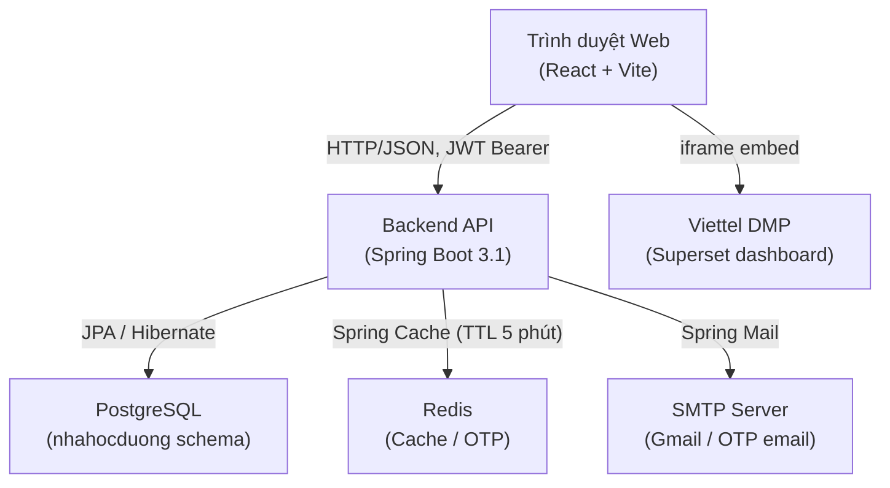

# Nha Học Đường — Hệ thống Quản lý Khám Răng Học Đường

Hệ thống phần mềm hỗ trợ chương trình khám răng học đường tại Bệnh viện Răng Hàm Mặt (BVRHM). Ứng dụng cho phép quản lý học sinh, tổ chức đợt khám, ghi nhận hồ sơ khám răng miệng, quản lý tài khoản bác sĩ và trường học, đồng thời cung cấp dashboard thống kê và khả năng xuất báo cáo.

---

## Mục lục

1. [Tổng quan bài toán](#1-tổng-quan-bài-toán)
2. [Trạng thái dự án](#2-trạng-thái-dự-án)
3. [Yêu cầu hệ thống](#3-yêu-cầu-hệ-thống)
4. [Hướng dẫn cài đặt](#4-hướng-dẫn-cài-đặt)
5. [Cấu hình biến môi trường](#5-cấu-hình-biến-môi-trường)
6. [Khởi tạo database](#6-khởi-tạo-database)
7. [Hướng dẫn chạy development](#7-hướng-dẫn-chạy-development)
8. [Hướng dẫn build và chạy production](#8-hướng-dẫn-build-và-chạy-production)
9. [Chạy bằng Docker](#9-chạy-bằng-docker)
10. [Hướng dẫn chạy test](#10-hướng-dẫn-chạy-test)
11. [Các chức năng chính](#11-các-chức-năng-chính)
12. [Vai trò người dùng và phân quyền](#12-vai-trò-người-dùng-và-phân-quyền)
13. [Kiến trúc hệ thống](#13-kiến-trúc-hệ-thống)
14. [Công nghệ sử dụng](#14-công-nghệ-sử-dụng)
15. [Cấu trúc thư mục](#15-cấu-trúc-thư-mục)
16. [Mô hình dữ liệu](#16-mô-hình-dữ-liệu)
17. [Các luồng nghiệp vụ quan trọng](#17-các-luồng-nghiệp-vụ-quan-trọng)
18. [Tài liệu API — Swagger](#18-tài-liệu-api--swagger)
19. [Cơ chế bảo mật](#19-cơ-chế-bảo-mật)
20. [Báo cáo và xuất dữ liệu](#20-báo-cáo-và-xuất-dữ-liệu)
21. [Hạn chế và chức năng đang phát triển](#21-hạn-chế-và-chức-năng-đang-phát-triển)
22. [License](#22-license)

---

## 1. Tổng quan bài toán

Chương trình khám răng học đường được tổ chức định kỳ bởi BVRHM nhằm phát hiện và điều trị sớm bệnh lý răng miệng cho học sinh. Hệ thống số hóa toàn bộ quy trình bao gồm:

- Quản lý thông tin trường học, lớp học và học sinh.
- Lập kế hoạch và phân công bác sĩ cho từng đợt khám.
- Ghi nhận hồ sơ khám điện tử với sơ đồ hàm răng (odontogram), hồ sơ mảng bám (plaque), cao răng (tartar) và biên bản điều trị.
- Quản lý năm học và chuyển lớp tự động.
- Thống kê tổng quan và xuất báo cáo Excel/PDF.

---

## 2. Trạng thái dự án

| Khu vực | Trạng thái |
|---|---|
| Backend API (Spring Boot) | Đang vận hành |
| Frontend (React + Vite) | Đang vận hành |
| Database schema (PostgreSQL) | Đang vận hành — quản lý bằng SQL dump thủ công |
| Xuất báo cáo Excel & PDF | Đã triển khai |
| Tích hợp dashboard Superset | Đã triển khai (nhúng iframe) |
| Docker Compose (PostgreSQL + Redis) | Đã triển khai — container app bị comment out |
| Monitoring (Prometheus + Grafana + Loki) | Cấu hình có sẵn nhưng bị comment out trong docker-compose |
| Migration tự động (Liquibase) | Đã comment out — không sử dụng |
| Tính năng kê đơn (Prescription) | Chỉ có entity và controller placeholder — bị comment out hoàn toàn |

---

## 3. Yêu cầu hệ thống

### Backend

| Yêu cầu | Phiên bản tối thiểu |
|---|---|
| Java | 17 |
| Maven | 3.8+ (hoặc dùng `mvnw` đi kèm) |
| PostgreSQL | 14+ |
| Redis | 6+ |

### Frontend

| Yêu cầu | Phiên bản tối thiểu |
|---|---|
| Node.js | 18+ |
| npm | 9+ |

### Docker (tùy chọn)

| Yêu cầu | Ghi chú |
|---|---|
| Docker | 24+ |
| Docker Compose | v2 (plugin `docker compose`) |

---

## 4. Hướng dẫn cài đặt

### Backend

```bash
cd nhahocduongbe

# Cài đặt dependency
./mvnw dependency:resolve

# Sao chép file môi trường
cp .env.example .env
# Chỉnh sửa .env với thông tin thực tế
```

### Frontend

```bash
cd nhahocduongfe

# Cài đặt dependency
npm install
```

---

## 5. Cấu hình biến môi trường

### Backend — file `nhahocduongbe/.env` (sao chép từ `.env.example`)

| Biến | Bắt buộc | Mô tả | Ví dụ an toàn |
|---|---|---|---|
| `DB_URL` | Có | JDBC URL kết nối PostgreSQL | `jdbc:postgresql://localhost:5432/nhahocduong` |
| `DB_USERNAME` | Có | Tên đăng nhập database | `nhahocduong` |
| `DB_PASSWORD` | Có | Mật khẩu database | _(không điền thật)_ |
| `REDIS_HOST` | Có | Hostname Redis | `localhost` |
| `REDIS_PORT` | Không | Cổng Redis (mặc định 6379) | `6379` |
| `REDIS_PASSWORD` | Có | Mật khẩu Redis | _(không điền thật)_ |
| `JWT_SIGNING_KEY` | Có | Khóa ký JWT (Base64-encoded 32 byte) | _(tạo bằng `openssl rand -hex 32`)_ |
| `JWT_EXPIRATION_MS` | Không | Thời gian sống access token (ms) | `2592000000` (30 ngày) |
| `MAIL_HOST` | Không | SMTP host (mặc định `smtp.gmail.com`) | `smtp.gmail.com` |
| `MAIL_PORT` | Không | SMTP port (mặc định 587) | `587` |
| `MAIL_USERNAME` | Có | Tài khoản email gửi OTP | _(không điền thật)_ |
| `MAIL_PASSWORD` | Có | Mật khẩu ứng dụng email | _(không điền thật)_ |
| `MAIL_FROM` | Không | Địa chỉ From trong email OTP | `noreply@nhahocduong.vn` |
| `OTP_EXPIRATION_MINUTES` | Không | Thời gian OTP có hiệu lực (phút) | `5` |

> **Ghi chú**: Với môi trường `dev`, giá trị mặc định được khai báo trong `application-dev.yaml` — không cần file `.env` nếu dùng database local không có mật khẩu.

### Frontend — file `nhahocduongfe/enviroments/.env.development`

| Biến | Bắt buộc | Mô tả | Ví dụ |
|---|---|---|---|
| `VITE_API_URL` | Có | Base URL của backend API | `http://localhost:8081` |

> **Lưu ý**: Thư mục `enviroments` (có lỗi chính tả) chứa file `.env.development` và `.env.production`. Vite đọc file `.env` theo `--mode` được truyền khi chạy.

---

## 6. Khởi tạo database

Schema và dữ liệu được quản lý hoàn toàn thủ công qua SQL dump. **Hệ thống không dùng migration tool tự động** (Liquibase đã bị comment out trong `pom.xml`).

### Cách 1: Dùng Docker Compose (khuyến nghị khi phát triển)

```bash
cd nhahocduongbe

# Khởi động PostgreSQL và Redis
docker compose up db cache -d
```

Docker Compose sẽ tự động nạp `backup_nhahocduong.sql` vào container PostgreSQL khi khởi động lần đầu (thông qua `docker-entrypoint-initdb.d`).

### Cách 2: Nạp thủ công vào PostgreSQL đã có sẵn

```bash
# Tạo database và schema
psql -U postgres -c "CREATE DATABASE nhahocduong;"
psql -U nhahocduong -d nhahocduong -f nhahocduongbe/backup_nhahocduong.sql
```

### Script seed dữ liệu mẫu (tùy chọn)

```bash
# Tại thư mục gốc nhd/
# Yêu cầu Python 3 và thư viện psycopg2
python seed_students.py
python fix_birthdate.py
python fix_class_and_index.py
python fix_ethnic.py
```

> Các script này dùng để tạo dữ liệu học sinh mẫu. Kết nối database được cấu hình bên trong từng script.

---

## 7. Hướng dẫn chạy development

### Backend

```bash
cd nhahocduongbe

# Cách 1: Dùng justfile
just dev

# Cách 2: Trực tiếp Maven Wrapper
./mvnw spring-boot:run -Dspring-boot.run.profiles=dev
```

Backend khởi động tại: `http://localhost:8081`

### Frontend

```bash
cd nhahocduongfe

# Cách 1: Dùng justfile
just dev

# Cách 2: Trực tiếp npm
npm run dev
```

Frontend khởi động tại: `http://localhost:5173`

---

## 8. Hướng dẫn build và chạy production

### Backend

```bash
cd nhahocduongbe

# Build JAR
./mvnw clean package -DskipTests

# Chạy với profile prod
java -jar target/api-0.0.1-SNAPSHOT.jar --spring.profiles.active=prod
```

### Frontend

```bash
cd nhahocduongfe

# Build cho production
npm run build-prod

# Kết quả build nằm trong thư mục dist/
# Phục vụ bằng Nginx hoặc bất kỳ static file server nào
npm run preview   # Xem trước production build locally
```

---

## 9. Chạy bằng Docker

> **Lưu ý**: Container cho ứng dụng backend (`app`), Prometheus, Grafana và Loki hiện đang bị **comment out** trong `docker-compose.yml`. Chỉ có PostgreSQL và Redis được cấu hình để chạy.

### Khởi động PostgreSQL và Redis

```bash
cd nhahocduongbe
docker compose up db cache -d
```

### Build và chạy backend thủ công bằng Docker

```bash
cd nhahocduongbe

# Bước 1: Build JAR
./mvnw clean package -DskipTests

# Bước 2: Build Docker image
docker build -t nhahocduong-api .

# Bước 3: Chạy container (ví dụ)
docker run -d \
  --name nhd-api \
  -p 8081:8081 \
  -e SPRING_PROFILES_ACTIVE=prod \
  -e DB_URL=jdbc:postgresql://... \
  -e DB_USERNAME=... \
  -e DB_PASSWORD=... \
  -e REDIS_HOST=... \
  -e REDIS_PASSWORD=... \
  -e JWT_SIGNING_KEY=... \
  -e MAIL_USERNAME=... \
  -e MAIL_PASSWORD=... \
  nhahocduong-api
```

---

## 10. Hướng dẫn chạy test

### Backend

```bash
cd nhahocduongbe

# Chạy tất cả test
./mvnw test
```

Hiện có **5 file test** đã xác minh:

| File test | Loại |
|---|---|
| `ModulithArchitectureTest` | Kiểm tra cấu trúc module (Spring Modulith) |
| `AreaServiceUnitTest` | Unit test — AreaService |
| `DiseaseServiceImplUnitTest` | Unit test — DiseaseService |
| `ExamCampaignServiceImplUnitTest` | Unit test — ExamCampaignService |
| `ExamServiceImplUnitTest` | Unit test — ExamService |
| `MedicalEnumServiceImplUnitTest` | Unit test — MedicalEnumService |

> **Lưu ý**: Phạm vi kiểm thử hiện tại còn hạn chế — chủ yếu bao phủ một số service đơn lẻ. Nhiều controller và service khác chưa có test.

### Frontend

Dự án frontend chưa có file test nào được xác minh.

---

## 11. Các chức năng chính

### 11.1. Xác thực và quản lý tài khoản

- **Đăng nhập** (`POST /api/auth/login`): trả về access token (JWT) trong body và refresh token qua `HttpOnly Cookie`.
- **Đăng xuất** (`POST /api/auth/logout`): xóa refresh token cookie.
- **Làm mới token** (`POST /api/auth/refresh`): sử dụng refresh token cookie.
- **Đăng ký tài khoản** (`POST /api/user/register`): yêu cầu xác thực email OTP trước.
- **Quên mật khẩu / Đặt lại mật khẩu**: luồng 3 bước — gửi OTP qua email (`/api/auth/forgot-password`) → xác thực OTP (`/api/auth/verify-otp`) → đặt mật khẩu mới (`/api/auth/reset-password`).
- **Đổi mật khẩu**: luồng tương tự, sử dụng endpoint `/api/auth/change-password-send-otp`.
- **Đăng nhập khách** (`POST /api/auth/guest-login`): trả về token với quyền hạn chế.
- **Duyệt / Từ chối đăng ký**: admin duyệt qua `PUT /api/user/{id}/approve`, từ chối qua `DELETE /api/user/{id}/reject`.
- **Khóa / Mở khóa tài khoản**: admin thực hiện qua `PUT /api/admin/users/{id}/lock` và `PUT /api/admin/users/{id}/unlock`.
- **Nhật ký đăng nhập**: lưu trong bảng `LOGIN_LOG`, truy vấn qua `GET /api/admin/login-logs`.

### 11.2. Quản lý tổ chức (Trường học)

- CRUD trường học (`/api/organization`): tạo, xem, cập nhật, xóa.
- Tìm kiếm có phân trang (`GET /api/organization/search`).
- Lấy toàn bộ danh sách (`GET /api/organization/all`).
- Kiểm tra lớp có thể xóa (`POST /api/organization/{id}/classes/deletable`).
- Cấu trúc lớp được lưu dưới dạng JSON (`Map<Grade, List<String>>`) trong bảng `nhahocduong_organization`.

### 11.3. Quản lý học sinh (Patient)

- CRUD học sinh (`/api/patient`).
- Tìm kiếm, lọc có phân trang (`GET /api/patient/search`).
- **Import Excel**: `POST /api/patient/excel` — đọc danh sách học sinh từ file Excel.
- **Export Excel**: `GET /api/patient/excel` — xuất toàn bộ danh sách học sinh.
- **Tải template Excel**: `GET /api/patient/excel/template`.

### 11.4. Năm học và chuyển lớp

- CRUD năm học (`/api/academic-years`).
- Lấy năm học hiện tại (`GET /api/academic-years/current`).
- **Kiểm tra trước khi chuyển năm** (`POST /api/academic-years/validate/{currentYearId}`): trả về danh sách cảnh báo.
- **Chuyển sang năm học mới** (`POST /api/academic-years/transition`): tự động tạo lớp mới, cập nhật quan hệ học sinh–lớp (`StudentClassAffiliation`), đánh dấu học sinh lớp 12 tốt nghiệp (`AffiliationStatus.GRADUATED`).
- **Rollback thao tác chuyển năm** (`POST /api/academic-years/rollback/{sessionId}`): khôi phục dựa trên `session_id` lưu trong `SystemLog`.
- **Lịch sử chuyển năm** (`GET /api/academic-years/history`): truy vấn từ bảng `system_log`.

### 11.5. Đợt khám và lịch khám

- CRUD đợt khám (`ExamCampaign`) tại `/api/exam-campaigns`.
- Trạng thái đợt khám: `UPCOMING` → `IN_PROGRESS` → `COMPLETED` / `CANCELLED`.
- Quản lý lịch khám (`ExamSchedule`) theo từng đợt, trường và lớp, có gán bác sĩ (`ManyToMany` với `Dentist`).
- Theo dõi trạng thái khám của học sinh trong đợt (`GET /api/exam-campaigns/{id}/students`).
- **Gửi thông báo cho bác sĩ** (`POST /api/exam-campaigns/{campaignId}/notify`): tạo bản ghi `Notification` cho từng bác sĩ được phân công.
- Danh sách học sinh cần tái khám (`GET /api/exams/re-exams`).

### 11.6. Hồ sơ khám và điều trị

- CRUD lần khám (`Exam`) theo học sinh (`/api/patients/{patientId}/exams`).
- Ghi nhận **sơ đồ hàm răng** (`TeethRecord`): lưu dưới dạng JSON (`Map<Tooth, ToothCondition>`) trong PostgreSQL.
- Ghi nhận **mảng bám** (`PlaqueRecord`) và **cao răng** (`TartarRecord`).
- Ghi nhận **danh sách điều trị** (`TreatmentRecord`) cho từng lần khám.
- Cập nhật **đánh giá bệnh lý** và **ghi chú điều trị** (`PATCH /api/exams/{examId}/assessment`).
- Cập nhật / xóa **ảnh trước và sau điều trị** (`PATCH /api/exams/{examId}/images`, `DELETE /api/exams/{examId}/images/{side}`).
- So sánh các lần khám: có component `CompareExamsView.tsx` ở frontend.
- Tra cứu danh sách bệnh lý (`/api/tartarCondition`, `/api/plaqueCondition`, `/api/toothProblem`, `/api/toothSide`, `/api/toothTreatment`, `/api/ethnics`).

### 11.7. Dashboard và thống kê

- Dashboard tổng quan (`GET /api/dashboard/stats`): số liệu đã khám, chưa khám, thống kê sâu răng theo trường và lớp.
- Thống kê chiến dịch (`GET /api/dashboard/campaign-stats`).
- Sĩ số học sinh theo trường và năm học (`GET /api/dashboard/student-count`).
- Lịch sử sĩ số qua các năm (`GET /api/dashboard/student-count-history`).
- **Báo cáo nâng cao**: nhúng dashboard từ Superset/Viettel DMP qua iframe (trang `Superset_BC1`).

### 11.8. Quản lý tài khoản (Admin)

- Xem danh sách tài khoản (`GET /api/admin/users`).
- Xem danh sách chờ duyệt (`GET /api/admin/waiting` hoặc `GET /api/user/waiting`).
- Xem nhật ký đăng nhập (`GET /api/admin/login-logs`).
- CRUD và tìm kiếm người dùng (`/api/user`).
- Xem và gán vai trò (`/api/roles`).

### 11.9. Thông báo (Notification)

- Lấy thông báo của người dùng hiện tại (`GET /api/notifications`).
- Đếm thông báo chưa đọc (`GET /api/notifications/unread-count`).
- Đánh dấu đã đọc (`PUT /api/notifications/{id}/read`).
- Đánh dấu tất cả đã đọc (`PUT /api/notifications/read-all`).

### 11.10. Dữ liệu địa phương (Vùng địa lý)

- Tra cứu tỉnh/thành, quận/huyện, phường/xã (`/api/areas/lookup`).
- Dữ liệu địa lý Việt Nam lưu trong thư mục `vn-geo` ở thư mục gốc.

---

## 12. Vai trò người dùng và phân quyền

Hệ thống sử dụng mô hình RBAC với bảng `USER_ROLE` và bảng liên kết `user_role_mapping`. Vai trò được lưu dưới dạng bản ghi trong database (không phải enum cứng) với trường `code` và `name`.

Phân quyền API được thực thi ở tầng filter (`JwtAuthenticationFilter`). Hiện tại, `SecurityConfig` chỉ phân biệt **endpoint công khai** và **endpoint yêu cầu xác thực** — chưa có phân quyền chi tiết theo role cụ thể ở tầng controller trong code đã xác minh.

| Vai trò | Quyền hạn chính (dựa trên endpoint và service) |
|---|---|
| **Admin** | Duyệt / từ chối / khóa / mở khóa tài khoản; xem nhật ký đăng nhập; quản lý toàn bộ người dùng và vai trò; CRUD tổ chức, năm học, đợt khám |
| **Bác sĩ (Dentist)** | Ghi nhận hồ sơ khám, sơ đồ hàm răng, điều trị; nhận thông báo lịch khám; xem danh sách học sinh được phân công |
| **Người dùng thông thường** | Xem dữ liệu theo tổ chức được gán; quản lý học sinh; xem và tạo đợt khám |
| **Khách (Guest)** | Token hạn chế, chỉ truy cập một số endpoint được cấu hình là `permitAll` |

> **Lưu ý**: Phân quyền chi tiết theo role ở từng controller chưa được implement đồng đều trong codebase — đây là điểm còn hạn chế.

---

## 13. Kiến trúc hệ thống



### Mô tả các thành phần

| Thành phần | Vai trò |
|---|---|
| **Frontend** | SPA React + Vite, giao tiếp với backend qua Axios. Quản lý trạng thái bằng Zustand. Routing với React Router v6. UI dùng MUI v5 + TailwindCSS + RSuite. |
| **Backend API** | Spring Boot 3.1 (Java 17). Chia module theo package: `auth`, `user`, `nhahocduong`, `common`, `system`. Sử dụng Spring Modulith cho kiểm tra kiến trúc module. |
| **Database** | PostgreSQL. Schema `nhahocduong`. Không dùng migration tự động — schema được quản lý bằng SQL dump (`backup_nhahocduong.sql`). |
| **Cache** | Redis — dùng cho Spring Cache (`@Cacheable`) với TTL 5 phút mặc định, lưu OTP token, refresh token. |
| **Authentication** | JWT access token (30 ngày mặc định) + HttpOnly Cookie chứa refresh token (30 ngày). Stateless session. |
| **Email** | Spring Mail qua SMTP (Gmail) — gửi mã OTP đăng ký và đặt lại mật khẩu. |
| **Báo cáo** | Apache POI (Excel) + OpenPDF (PDF) — xuất trực tiếp từ backend. |
| **Dashboard nâng cao** | Superset (Viettel DMP) — nhúng iframe trong frontend. |

---

## 14. Công nghệ sử dụng

| Thành phần | Công nghệ | Phiên bản |
|---|---|---|
| **Backend language** | Java | 17 |
| **Backend framework** | Spring Boot | 3.1.0 |
| **ORM** | Spring Data JPA + Hibernate | — |
| **Security** | Spring Security | — |
| **JWT** | JJWT | 0.11.5 |
| **Database** | PostgreSQL | 17 (Docker image) |
| **Cache / Session** | Redis | alpine (Docker image) |
| **Mapping** | MapStruct | 1.5.3.Final |
| **Code generation** | Lombok | 1.18.30 |
| **Excel** | Apache POI | 5.2.3 |
| **PDF** | OpenPDF | 2.0.2 |
| **API docs** | SpringDoc OpenAPI (Swagger UI) | 2.1.0 |
| **Metrics** | Micrometer + Prometheus | 1.11.5 |
| **Build tool** | Maven Wrapper (mvnw) | — |
| **Module testing** | Spring Modulith | 0.6.0 |
| **Frontend language** | TypeScript | 5.x |
| **Frontend framework** | React | 18.2 |
| **Build tool (FE)** | Vite | 4.x |
| **UI components** | MUI (Material UI) | 5.13.5 |
| **CSS framework** | TailwindCSS | 3.3 |
| **UI extras** | RSuite, Headless UI, Heroicons | — |
| **HTTP client** | Axios | 1.4 |
| **State management** | Zustand | 4.3.8 |
| **Form** | React Hook Form + Formik + Yup | — |
| **Routing** | React Router DOM | 6.x |
| **Data fetching** | React Query | 3.x |
| **Containers** | Docker + Docker Compose | — |

---

## 15. Cấu trúc thư mục

```
nhd/                                  # Thư mục gốc repository
├── nhahocduongbe/                    # Backend (Spring Boot)
│   ├── src/main/java/
│   │   └── vn/viettel/bvrhm/nhahocduong/api/
│   │       ├── auth/                 # Xác thực, JWT, OTP, refresh token
│   │       │   ├── filter/           # JwtAuthenticationFilter
│   │       │   └── internal/
│   │       │       ├── controller/   # AuthenticationController, PasswordResetController
│   │       │       ├── entity/       # LoginLog, OtpToken, RefreshToken, UserPassword, Policy, Rule
│   │       │       └── service/      # AuthenticationService, JwtService, OtpService
│   │       ├── user/                 # Quản lý người dùng và vai trò
│   │       │   └── internal/
│   │       │       ├── controller/   # AdminController, UserController, RoleController
│   │       │       └── entity/       # User, Role
│   │       ├── nhahocduong/          # Logic nghiệp vụ chính
│   │       │   └── internal/
│   │       │       ├── controller/   # 17 controller (Patient, Exam, Organization, ...)
│   │       │       ├── entity/       # 18 entity (Patient, Exam, ExamCampaign, ...)
│   │       │       ├── service/impl/ # 17 service implementation
│   │       │       ├── repository/   # Spring Data JPA repository
│   │       │       ├── dto/          # Data Transfer Objects
│   │       │       ├── mapper/       # MapStruct mappers
│   │       │       └── data/excel/   # Logic đọc/ghi file Excel
│   │       ├── common/               # Dùng chung: BaseEntity, AreaController, ...
│   │       └── system/
│   │           ├── security/         # SecurityConfig, AuthenticationProvider
│   │           └── openapi/          # OpenApiConfig (Swagger)
│   ├── src/main/resources/
│   │   ├── application.yaml          # Cấu hình chung (port 8081, mail, OTP)
│   │   ├── application-dev.yaml      # Cấu hình development (DB, Redis local)
│   │   ├── application-prod.yaml     # Cấu hình production
│   │   └── application-prod-docker.yaml
│   ├── src/test/                     # 5 unit test class
│   ├── backup_nhahocduong.sql        # SQL dump — dữ liệu khởi tạo database
│   ├── docker-compose.yml            # PostgreSQL + Redis containers
│   ├── Dockerfile                    # Image backend (eclipse-temurin:17-jre-alpine)
│   ├── .env.example                  # Mẫu biến môi trường
│   ├── justfile                      # Lệnh tắt: `just dev`
│   └── pom.xml
│
├── nhahocduongfe/                    # Frontend (React + Vite)
│   ├── src/
│   │   ├── api/                      # Axios API clients (9 file)
│   │   │   ├── api.ts                # Axios instance, interceptors
│   │   │   ├── userApi.ts            # Tài khoản, admin, OTP
│   │   │   ├── reportApi.ts          # Xuất Excel/PDF
│   │   │   ├── notificationApi.ts    # Thông báo
│   │   │   ├── examApi.ts            # Lần khám
│   │   │   ├── examCampaignApi.ts    # Đợt khám
│   │   │   └── dentistApi.ts         # Bác sĩ
│   │   ├── pages/                    # 11 module trang
│   │   │   ├── Dashboard/            # Tổng quan thống kê
│   │   │   ├── Patient/              # Danh sách, chi tiết, tạo học sinh
│   │   │   ├── DentalRecord/         # Hồ sơ khám, sơ đồ hàm răng (Odontogram)
│   │   │   ├── ExamCampaign/         # Đợt khám, lịch khám, theo dõi, tái khám
│   │   │   ├── AcademicYear/         # Năm học (chỉ có thư mục, không có file .tsx)
│   │   │   ├── Management/           # Quản lý người dùng, duyệt tài khoản, nhật ký
│   │   │   ├── Superset_BC1/         # Nhúng dashboard Superset
│   │   │   ├── Login/                # Đăng nhập, đổi mật khẩu
│   │   │   ├── Signup/               # Đăng ký
│   │   │   ├── ForgotPassword/       # Quên mật khẩu
│   │   │   └── Logout/               # Đăng xuất
│   │   ├── components/               # Component dùng chung
│   │   ├── stores/                   # Zustand stores (auth, user, theme, root)
│   │   ├── routes/                   # AppRoutes, ProtectedRoutes, PublicRoutes
│   │   ├── hooks/                    # Custom hooks
│   │   ├── types/                    # TypeScript types
│   │   └── utils/                    # Hàm tiện ích
│   ├── enviroments/                  # [Lỗi chính tả] Thư mục chứa .env
│   │   ├── .env.development          # VITE_API_URL=http://localhost:8081
│   │   └── .env.production           # VITE_API_URL=https://...
│   ├── package.json
│   ├── vite.config.ts
│   ├── tailwind.config.js
│   └── justfile                      # Lệnh tắt: `just dev`
│
├── vn-geo/                           # Dữ liệu địa lý Việt Nam (tỉnh/huyện/xã)
├── seed_students.py                  # Script seed dữ liệu học sinh (Python)
├── fix_birthdate.py                  # Script sửa ngày sinh (Python)
├── fix_class_and_index.py            # Script sửa lớp và chỉ số (Python)
├── fix_ethnic.py                     # Script sửa dân tộc (Python)
└── .env                              # File môi trường gốc (không commit)
```

---

## 16. Mô hình dữ liệu

### Các entity chính và quan hệ

```mermaid
erDiagram
    USER_USER {
        Long id PK
        String username
        String email
        String password
        String firstName
        String lastName
        Long organization FK
        Boolean registerStatus
    }
    USER_ROLE {
        Long id PK
        String code
        String name
        Boolean status
    }
    user_role_mapping {
        Long user_id FK
        Long role_id FK
    }
    nhahocduong_organization {
        Long id PK
        String name
        String code
        String address
        String areaCode
        OrganizationType type
        JSON classes
        Boolean status
    }
    nhahocduong_patient {
        Long id PK
        String fullName
        String code
        LocalDate birthDate
        Integer gender
        String ethnic
        Long organization FK
        String schoolClass
        Boolean status
    }
    academic_year {
        Long id PK
        String name
        LocalDate startDate
        LocalDate endDate
        AcademicYearStatus status
    }
    class {
        Long id PK
        String name
        String grade
        String room
        Long school_id FK
        Long academic_year_id FK
    }
    student_class_affiliation {
        Long id PK
        Long student_id FK
        Long class_id FK
        Long academic_year_id FK
        AffiliationStatus status
    }
    nhahocduong_exam_campaign {
        Long id PK
        String name
        CampaignStatus campaignStatus
        LocalDate startDate
        LocalDate endDate
    }
    nhahocduong_exam_schedule {
        Long id PK
        Long campaign_id FK
        Long organization_id FK
        String schoolClass
        LocalDate examDate
    }
    nhahocduong_exam {
        Long id PK
        Long patient_id FK
        Long dentist_id FK
        Long organization_id FK
        Long campaign_id FK
        LocalDate date
        LocalDate reExamDate
        String pathologyAssessment
        String treatmentNote
        String imageUpperUrl
        String imageLowerUrl
    }
    nhahocduong_teeth_record {
        Long id PK
        JSON record
    }
    nhahocduong_treatment_record {
        Long id PK
        Long exam_id FK
    }

    USER_USER ||--o{ user_role_mapping : "có"
    USER_ROLE ||--o{ user_role_mapping : "gán"
    USER_USER }o--|| nhahocduong_organization : "thuộc"
    nhahocduong_patient }o--|| nhahocduong_organization : "học tại"
    nhahocduong_patient ||--o{ student_class_affiliation : "có"
    class ||--o{ student_class_affiliation : "chứa"
    class }o--|| nhahocduong_organization : "thuộc"
    class }o--|| academic_year : "thuộc"
    nhahocduong_exam }o--|| nhahocduong_patient : "của"
    nhahocduong_exam }o--|| nhahocduong_exam_campaign : "thuộc"
    nhahocduong_exam ||--o| nhahocduong_teeth_record : "có"
    nhahocduong_exam ||--o{ nhahocduong_treatment_record : "có"
    nhahocduong_exam_schedule }o--|| nhahocduong_exam_campaign : "thuộc"
```

### Mô tả entity quan trọng

| Entity | Bảng | Mô tả |
|---|---|---|
| `User` | `USER_USER` | Tài khoản người dùng hệ thống |
| `Role` | `USER_ROLE` | Vai trò, liên kết qua `user_role_mapping` |
| `Organization` | `nhahocduong_organization` | Trường học, lưu danh sách lớp dạng JSON |
| `Patient` | `nhahocduong_patient` | Học sinh |
| `AcademicYear` | `academic_year` | Năm học với trạng thái `UPCOMING/CURRENT/COMPLETED` |
| `Class` | `class` | Lớp học gắn với trường và năm học |
| `StudentClassAffiliation` | `student_class_affiliation` | Quan hệ học sinh–lớp–năm học với trạng thái `STUDYING/PROMOTED/GRADUATED` |
| `ExamCampaign` | `nhahocduong_exam_campaign` | Đợt khám với trạng thái `UPCOMING/IN_PROGRESS/COMPLETED/CANCELLED` |
| `ExamSchedule` | `nhahocduong_exam_schedule` | Lịch khám theo trường, lớp, ngày, bác sĩ |
| `Exam` | `nhahocduong_exam` | Hồ sơ một lần khám, có ảnh trước/sau điều trị |
| `TeethRecord` | `nhahocduong_teeth_record` | Sơ đồ hàm răng dạng JSON `Map<Tooth, ToothCondition>` |
| `PlaqueRecord` | `nhahocduong_plaque_record` | Chỉ số mảng bám |
| `TartarRecord` | `nhahocduong_tartar_record` | Chỉ số cao răng |
| `TreatmentRecord` | `nhahocduong_treatment_record` | Biên bản điều trị từng lần khám |
| `Notification` | `nhahocduong_notification` | Thông báo nội bộ cho bác sĩ |
| `SystemLog` | `system_log` | Ghi log thao tác quan trọng (chuyển năm, rollback) |
| `LoginLog` | `LOGIN_LOG` | Nhật ký đăng nhập |
| `OtpToken` | — | Lưu OTP và reset token trong Redis |
| `RefreshToken` | — | Refresh token liên kết với User |
| `BaseEntity` | — | Lớp cha: `status`, `createdDate`, `updatedDate`, `createdBy`, `updatedBy` |

---

## 17. Các luồng nghiệp vụ quan trọng

### 17.1. Luồng đăng ký tài khoản

```
Người dùng gửi thông tin → Backend gửi OTP qua email
→ Người dùng nhập OTP → Backend xác thực → Trả về reset token
→ Người dùng hoàn tất đăng ký (kèm token) → Tài khoản tạo với registerStatus = false
→ Admin duyệt → registerStatus = true → Người dùng có thể đăng nhập
```

### 17.2. Luồng đăng nhập

```
POST /api/auth/login (username + password)
→ Xác thực password (BCrypt) + kiểm tra registerStatus
→ Tạo access token (JWT, 30 ngày) + refresh token
→ Access token trả trong body; Refresh token đặt trong HttpOnly Cookie
→ Frontend lưu access token vào localStorage, tự động refresh khi gần hết hạn
```

### 17.3. Luồng chuyển năm học

```
Admin kiểm tra (POST /validate/{currentYearId})
→ Hệ thống trả danh sách cảnh báo (học sinh chưa phân lớp, v.v.)
→ Admin xác nhận chuyển (POST /transition) với sessionId
→ Backend: tạo lớp mới, cập nhật StudentClassAffiliation
  - Học sinh lớp 12 → AffiliationStatus.GRADUATED
  - Học sinh khác → tạo affiliation mới cho năm sau
→ Ghi SystemLog với oldValue/newValue (JSON) để hỗ trợ rollback
→ Rollback: POST /rollback/{sessionId} → đọc SystemLog, hoàn tác
```

### 17.4. Luồng ghi nhận hồ sơ khám

```
Bác sĩ chọn đợt khám → chọn học sinh (từ danh sách được phân công)
→ Tạo lần khám (POST /patients/{id}/exams)
→ Ghi sơ đồ hàm răng (POST /patients/{id}/exams/{examId}/teethRecord)
→ Ghi mảng bám, cao răng (POST .../plaqueRecord, .../tartarRecord)
→ Ghi danh sách điều trị (POST .../treatmentRecord)
→ Cập nhật đánh giá bệnh lý, ghi chú (PATCH /exams/{examId}/assessment)
→ Upload ảnh trước/sau điều trị (PATCH /exams/{examId}/images)
→ Đặt ngày tái khám nếu cần
```

---

## 18. Tài liệu API — Swagger

Backend tích hợp **SpringDoc OpenAPI** (Swagger UI). Sau khi khởi động, truy cập tài liệu API tại:

```
http://localhost:8081/swagger-ui.html
http://localhost:8081/v3/api-docs
```

Swagger UI được cấu hình là public endpoint (không yêu cầu xác thực).

### Nhóm endpoint chính

| Nhóm | Prefix | Mô tả |
|---|---|---|
| Authentication | `/api/auth` | Đăng nhập, đăng xuất, refresh, OTP, đặt lại mật khẩu |
| User | `/api/user` | Đăng ký, xem thông tin, duyệt/từ chối |
| Admin | `/api/admin` | Quản lý tài khoản, khóa/mở khóa, nhật ký đăng nhập |
| Role | `/api/roles` | Danh sách vai trò |
| Organization | `/api/organization` | CRUD trường học |
| Patient | `/api/patient` | CRUD học sinh, import/export Excel |
| Exam | `/api/patients/{id}/exams` | CRUD lần khám, ảnh, đánh giá |
| TeethRecord | `/api/patients/{id}/exams/{id}/teethRecord` | Sơ đồ hàm răng |
| PlaqueRecord | `/api/patients/{id}/exams/{id}/plaqueRecord` | Mảng bám |
| TartarRecord | `/api/patients/{id}/exams/{id}/tartarRecord` | Cao răng |
| TreatmentRecord | `/api/patients/{id}/exams/{id}/treatmentRecord` | Điều trị |
| ExamCampaign | `/api/exam-campaigns` | CRUD đợt khám, lịch khám, thông báo |
| AcademicYear | `/api/academic-years` | CRUD năm học, chuyển năm, rollback |
| Dashboard | `/api/dashboard` | Thống kê tổng quan |
| Notification | `/api/notifications` | Thông báo người dùng |
| Report | `/api/students/{id}/exam-report/pdf` | Xuất PDF phiếu khám |
| School Report | `/api/schools/export/excel` | Xuất Excel báo cáo trường |
| Medical Enum | `/api/tartarCondition`, `/api/plaqueCondition`, ... | Danh sách mã tra cứu |
| Area | `/api/areas` | Tra cứu địa giới hành chính |
| Dentist | `/api/dentists` | Danh sách bác sĩ |

---

## 19. Cơ chế bảo mật

| Cơ chế | Mô tả |
|---|---|
| **Authentication** | JWT (access token) + HttpOnly Cookie (refresh token). Stateless — không dùng server-side session. |
| **Password hashing** | BCrypt (`BCryptPasswordEncoder`). |
| **OTP** | Mã 6 chữ số gửi qua email, lưu trong Redis với TTL 5 phút mặc định. Giới hạn 5 lần gửi/giờ. |
| **Authorization** | Spring Security `SecurityFilterChain` — phân biệt endpoint công khai và yêu cầu xác thực. Phân quyền chi tiết theo role chưa được áp dụng đồng đều. |
| **CORS** | Cấu hình trong `SecurityConfig`, cho phép `localhost:*` và `127.0.0.1:*`. |
| **Input validation** | Bean Validation (`jakarta.validation`) ở một số controller và request class. |
| **Soft delete** | `BaseEntity` có trường `status` (Boolean) — xóa mềm được áp dụng cho hầu hết entity. Bộ lọc `@Where(clause = "status = true")` được dùng ở một số quan hệ trong `Exam`. |
| **Audit trail (Exam/User)** | `BaseEntity` lưu `createdDate`, `updatedDate`, `createdBy`, `updatedBy`. |
| **System log (chuyển năm)** | `SystemLog` lưu `action`, `entityType`, `oldValue`, `newValue` dạng JSON để phục vụ rollback. |
| **Login log** | Bảng `LOGIN_LOG` ghi thời điểm và kết quả đăng nhập. |
| **Token revocation** | Refresh token được lưu và xóa khỏi database/Redis khi logout hoặc refresh. |

---

## 20. Báo cáo và xuất dữ liệu

| Loại | Endpoint | Mô tả |
|---|---|---|
| **Xuất danh sách học sinh (Excel)** | `GET /api/patient/excel` | Toàn bộ danh sách học sinh |
| **Template import học sinh (Excel)** | `GET /api/patient/excel/template` | File mẫu để import |
| **Import học sinh từ Excel** | `POST /api/patient/excel` | Đọc file Excel, tạo hàng loạt |
| **Báo cáo tổng hợp các trường (Excel)** | `GET /api/schools/export/excel` | Tổng hợp dữ liệu tất cả trường |
| **Báo cáo học sinh theo trường (Excel)** | `GET /api/schools/{schoolId}/students/export/excel` | Danh sách học sinh một trường |
| **Phiếu khám học sinh (PDF)** | `GET /api/students/{studentId}/exam-report/pdf` | Phiếu khám cá nhân của một học sinh |
| **Dashboard nâng cao** | Trang `Superset_BC1` (iframe) | Nhúng dashboard từ Viettel DMP Superset |

Thư viện sử dụng: **Apache POI 5.2.3** cho Excel, **OpenPDF 2.0.2** cho PDF.

---

## 21. Hạn chế và chức năng đang phát triển

### Chức năng chưa hoàn thiện hoặc bị tắt

| Chức năng | Trạng thái |
|---|---|
| **Kê đơn thuốc (Prescription)** | Controller có nhưng toàn bộ logic bị comment out — chưa hoạt động |
| **Container hóa backend** | Dockerfile và service `app` trong `docker-compose.yml` bị comment out — chưa tích hợp vào Compose |
| **Giám sát (Prometheus + Grafana + Loki)** | Cấu hình có sẵn nhưng bị comment out trong `docker-compose.yml` |
| **Trang Năm học (AcademicYear) ở FE** | Thư mục `pages/AcademicYear` tồn tại nhưng không có file `.tsx` — chưa có giao diện frontend |
| **Phân quyền chi tiết theo role** | Backend có entity `Policy` và `Rule` trong module `auth` nhưng chưa được tích hợp vào Security filter |
| **Backup và Restore database** | Chưa có script hoặc endpoint tự động |
| **CI/CD pipeline** | Chưa có file cấu hình CI/CD (GitHub Actions, GitLab CI,...) trong repository |
| **Đồng bộ dữ liệu lớp theo Organization** | Danh sách lớp được lưu trùng lặp cả trong `Organization.classes` (JSON) lẫn bảng `class` riêng — cần làm rõ nguồn sự thật |

### Hạn chế đã biết

- Thư mục môi trường frontend đặt tên là `enviroments` (thiếu chữ "n") — có thể gây nhầm lẫn.
- Phiên bản Spring Modulith (`0.6.0`) là experimental — API có thể thay đổi theo phiên bản Spring Boot mới.
- `SecurityConfig` hiện đặt `CORS_ALLOWED_ORIGINS` cứng trong code cho `localhost` — biến `CORS_ALLOWED_ORIGINS` trong `.env.example` chưa được đọc trong `SecurityConfig` đã xác minh.
- Test coverage còn hạn chế — chỉ có 5 unit test cho một số service.

---

## 22. License

Repository này **chưa khai báo license**. Mọi sử dụng nằm ngoài mục đích nội bộ của nhóm phát triển cần được sự đồng ý của tác giả.

---

*Tài liệu này được tạo bằng cách phân tích trực tiếp source code và configuration trong repository. Mọi mô tả phản ánh trạng thái implementation tại thời điểm phân tích.*
